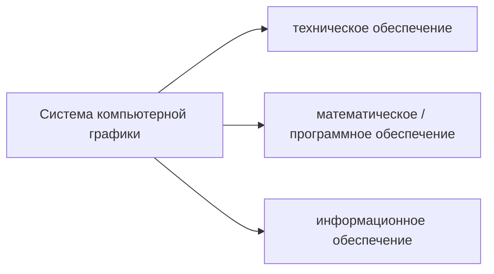
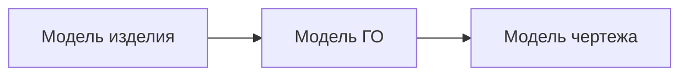

---

**Текстовый документ** -- совокупность алфавитно-цифровых символов и спецзнаков

**Графическая информация или графический документ** -- любая совокупность графических элементов или примитивов (точка, линия, дуга, окружность), а также изображений или текстов.

Можно говорить, что текстовая информация в общем-то частный случай графической.

Сам термин КГ, а ранее машинная графика, обозначает автоматизацию кодирования, обработки и декодирования графической информации. Иными словами, ввод в компьютер исходных данных, представленных в графической форме, обработку этой информации с помощью специальных графических программ и вывод результатов расчётов или моделирования в виде различных графических изображений.

Таким образом, графическое изображение является как исходным, так и конечным продуктом компьютерной графики.

Компьютерная графика -- это создание изображений с помощью компьютера.

Уровень развития КГ определяет эффективность функционирования современных IT технологий. КГ обеспечивает решения практического использования IT, то есть поддерживает взаимодействие пользователя с вычислительной машиной или системой, то есть решает проблему HCI -- human-computer interaction,

Как одной из научных направлений КГ является создание GUI, причём более важна реализация этого взаимодействия -- режим inline.

Стоит отметить, что впервые режим интерактивного взаимодействия был обеспечен в ScratchPad в MIT в конце 60-ых под руководством Айзека Сазерленда.

В настоящее время в КГ оформились три основных направления обработки графической информации

I. Создание изображения из графических примитивов и его визуализация или возможность просмотра исходя из модельного описания того, что требуется отобразить.

В ряде графических пакетов это направление объединено в корневом каталоге графического редактора под корнем Draw (рисование).

II. Обработка изображения или преобразование изображения

В большинстве графических процедур это скрыто под корнем Edit / Modify.

Задачей ОИ мб или специальное преобразование, кардинально меняющее существующее изображение, или улучшение изображения (реконструкция, реставрация, раскраска) в зависимости от определённых или заданных критериев обработки этого изображения.

III. Распознавание образов или получение описания и анализ изображений исследуемых графических объектов.

Цель распознавания -- выделение отдельных элементов на изображении или классификация изображений в целом. Или, например, определение динамических объектов -- тех, которые изменяют своё положение относительно каких-то опорных маркеров на изображении.

В этом направлении как инструмент используется **когнитивная графика**, или графика, облегчающая познания. Эта графика занимается синтезом или анализом абстрактных изображений, не имеющих реальных физических аналогов. Например, построение диаграмм, гистограмм, графиков распределений, которые в наглядной форме представляют абстрактные сущности как результат творческой и умственной работы пользователя.

План курса

1. Концепция и возможности КГ
2. Математические основы создания моделей-описаний геометрических объектов и моделей преобразований ГО
3. Современные дисплейные технологии представления графической информации
4. Разделы ПО КГ

КГ и родственная ей вычислительная геометрия являются самостоятельным со своими проблемами и спецификой и областями деятельности. В основе этх дисциплин в теортическом плане лежат разделы р=гоеметрии: ангем, начертательна геометрия, дифференаицлаьная геометрия и т.д.. а так же некоторые разделы матричной алгебры, вычислительной математики, которые являются математической базой для построения модели геометрического объекта.

Это можно пояснить следующей схемой:

**Модель ГО** -- создание моделей геометрического объекта относится к теоретическим основам компьютерной графики. Чтобы компьютер понимал, какая информация вводится, должна присутствовать некоторая **прикладная графическая программа**. Чтобы эти программы функционировали в ОС компьютера, должны быть какие-то графические системные оболочки. Это в конце концов обрабатывается ЭВМ

Всё восприятие информации окружающей действительности современном компьютером идёт через понятие **модели**.

**Векторные модели** -- в памяти компьютера объекты представлены координатами характеристических точек и математическими моделями кривых и поверхностей. Например, отрезок задаётся координатами начальной и конечной точки и уравнением прямой, проходящей через эти точки. Точки реального объекта соединяются отрезками прямых линий или векторами.

В **растровой модели** плоская или 2D - пространство, или объёмное 3D пространство состоит из множества одинаковые элементарных областей (пиксель или воксел), а геометрический объект представляется как множество занимаемых им элементов этого дискретного пространства.

Сравнивая эти два подхода, можно сказать, что есть определённые достоинства и недостатки. 

**Плюсы векторной модели**
- высокая точность изображения
- меньшая память для хранения модели геометрического объекта

**Минус** -- худшая реалистичность изображения, потому что в растровой модели элементы растра независимы друг от друга и могут принимать любые значения цвета, тона из допустимого диапазона, то есть как бы изображение складывается из комбинации цветных точек.

Можно говорить о гибридных моделях -- сочетание векторных и растровых форм представления, которые позволяют взаимное преобразование описаний области пространства.

Переход от векторной форме к растровой достаточно прост и заключается в пересчёте координат векторов в адреса пикселей, а именно номер строки и номер столбца в сетке растра на экране монитора.

Обратный переход более сложен, так как возникают неоднозначности преобразования в ряде случаев. 

Следует сказать, что большинство современных устройств графического вывода (мониторы, принтеры) являются в принципе растровыми и отображаются любое изображение в виде совокупности соответствующих цветных или черно-белых точек.

Описание графических данных в цифровом виде в соответствии  с определёнными правилами называют **графическими форматами**.

## Этапы развития систем КГ
Начало развития работ по КГ -- середина 50-ых годов, когда США и СССР провели первые опыты по использованию методов компьютерной графики на ЭВМ, память которых была устроена на электронно-лучевых трубках. На экранах таких трубок тёмные и светлые точки соответствовали логическим нулям и единицам. Следовательно, создавая подходящие двоичные коды, можно получить нужное изображение. Эти опыты послужили стимулом для разработки специальных ЭЛТ, для запоминания характроны. Время запоминания информации на которых было от нескольких минут до двух часов. Эти первые опыты послужили стимулов для разработки специальных ЭЛТ с запоминанием, которые были предназначены для вывода графической информации из ЭВМ.

Следующее десятилетие: к середине 60-ых годов КГ формируется как самостоятельное направление исследований. Начато промышленное производство графопостроителей и векторных дисплеев, образуется рынок новых высоких технологий

Начало 70-ых годов характерно становлением рынка программных продуктов КГ и окончательное его формирование произошло к концу 70-ых годов, когда пришло понимание необходимости стандартизации графических систем. И эта тема в течение ряда нескольких последующих лет была очень злободневна, так как к тому времени в мире функционировало больше сотни оригинальных графических систем с оригинальным устройством, связь между которыми была невозможна.

Ну рубеже 80-ых годов появилась доступная полупроводниковая память и произошёл резкий переход к растровым принципам отображения информации. К этому времени как раз появились первые персональные компьютеры, средства КГ нашли применение именно там, и это снизило их стоимость и увеличило их популярность и доступность.

Середина 80-ых: изменения, связанные с развитием технологии сверхбольших интегральным схем (СБИС, матричные БИС МАБИС и т.д.), привели к созданию рабочих графических станций, произошло их объединение в сети, были разработаны графические сопроцессоры, так как к тому времени были только процессоры с фиксированной точкой и с плавающей точкой; в частности, для поддержки 3Д, БПФ, динамических изображений и тд. Все этти нововведения резко повысили производительность: были созданы графические станции, по мощности не уступавшие суперкомпьютером того времени. Растровая графика в реальном мастабе для объёмной визуализации стала реальностью.

КГ оказала огромное влияние на сферу коммуникации между человеком и компьютером, а также между людьми при помощи графических образов, появился язык общения через картинку.

Существенным стимулом к совершенствованию методов КГ является стремление к реалистичности, даже к фотореалистичности создаваемых изображений. То есть как с помощью компьютера передать на экране дисплея форму, цвет, освещение, движения практически не отличимые от тех, что существуют в действительности. 

Наука ищет формальные подходы к описанию перечисленных процессов.


## Обеспечение графических возможностей в вычислительных системах


Сейчас удовлетворение этой потребности возможно по двум направлениям

1) использование языковых средств, то есть практически во всех ЯП высокого уровня есть специальные программные средства, обеспечивающие графику с той или иной степени. Например, в C есть 4 базовых подпрограммы или функции для реализации графики на устройствах ввода-вывода графической информации, в частности, экрана графического дисплея или чертёжном поле графопостроителя. Это 
	- `initgr()` -- инициализация графического ввода
	-  `move(x, y)` -- позиционирование луча на экране или пера графопостроителя в точке с координатами x, y
	- `draw(x, y)` -- рисование отрезка прямой линии от текущей позиции в заданную точку с координатами x, y
	- `endgr()` -- выполнение ряда операций, связанных с завершением графическом программы.

Используя эти 4 функции, возможно построение графического изображения в виде совокупности коротких отрезков прямых.

2) Использование специальных пакетов графических процедур: например, в САПР это пакеты AutoCAD, pCAD, Mechanical Desktop и т.д., которые имеют специальные графические редакторы и направленность на решение конкретных практических задач. Также есть corel draw, фотошоп и т.д.


Чисто исторически можно вспомнить о **псевдографике**: формировании изображений с помощью символов кода ASCII, которые имеются на стандартной клавиатуре ПК.

Методы и алгоритмы должны обязательно соответствовать архитектуре ПК и ОС. Сейчас также более рационально использовать, например, функции API Windows как интерфейса для разработки прикладных программ, то есть в тексты программ можно включать вызовы функций, которые входят в состав графических функций API, в которой обеспечена аппаратная независимость многих функций от конкретных графических устройств ввода-вывода.

Интересная функция API Windows -- `SetPixel(hdc, x, y, clr)`. Здесь
- `hdc` -- идентификатор контекста графического устройства или некоторое числовое значение, знание которого даёт возможность направить графический вывод в нужное место
- `x`, `y` -- координаты пикселя на плоскости
- `clr` -- цвет пикселя: 4 байтное слово, где 3 младших байта соответствуют компонентам RGB.

С помощью одной это единственной функции возможно создать любое растровое изображение, правда, программа для этого будет большая.


Также для расширения графических возможностей можно использовать библиотеки типа OpenGL и DirectX 3D. Это также наборы API для разработки мультимедийных приложений, связанных с визуализацией 3D графики. 

## Области применения КГ
### 1. Автоматизация проектирования изделий различного назначения 

(около 80%, самая обширная область применения). Прежде всего это САПР в микроэлектронике, используемые в схемотехнике, области машиностроения, авиация, автомобиле- и судостроения как наиболее ёмкие отрасли.

Можно отметить некоторые объективные факторы, влияющие на техническую политику как государств, так и крупных НИИ:
1. Пришло время ограничения всех ресурсов: энергии, материалов, времени, людских ресурсов и раньше всего это осознали страны западной Европы, страны восточной Азии, США
2. Резкий рост числа образцов новой техники
3. Уменьшение срока жизни образца техники, особенно в электронике, ВТ, приборо-, авиастроения и других отраслях
4. Рост уровня сложности образца новой техники, и, как следствие этого, увеличение срока проектирования и рост числа необходимых проектировщиков.


Опыт применения САПР показывает изменение следующих показателей
- на 10-15% улучшаются технические характеристики изделия, сделанного с помощью САПР
- до 20% уменьшается материалоёмкость изделия
- в 2-4 раза сокращается время проектирования изделия
- в 20-50 раз сокращается время на подготовку тех. документации на производство изделия
- появление новых творческих возможностей у проектировщика за счёт возможностей анализа многих вариантов решения задач проектирования в реальном времени.

Есть и недостатки:
- очень дорогое ПО: например, для производства элементов ВТ стоит несколько десятков млн долларов
- кадры и их подготовка -- дорогостоящее удовольствие

Но в то же время по данным UNESCO уровень развития САПР -- показатель интеллектуального развития страны, и, кроме того, САПР -- один из самых дорогих товаров на рынке ПО.

### 2. Автоматизация и визуализация научных исследований
Области применения: ядерная физика, робототехника, медицина, химия, биология и даже социология.


### 3. Обработка различных видов графической информации большого объёма
Это отрасли: метеорология, геология, геодезия, картография, системы ГИС и тд

### 4. Строительство и архитектура

Прежде всего: транспортные сети, дороги, жд, морские и речные коммуникации; трубопроводы: гах, нефть, вода:

массопроводы (химия)

Полученные в 3 пункте хорошие карты и изображения позволяют проложить соответствующие транспортные сети более быстро и качественно, чем в традиционных методах поисковых экспедиций.

### 5. Деловая графика

Это обслуживание бирж, банков, офисов, рекламы и т.д.

### 6. Обучение, самообучение

Использование графики для преподавания в учебных учреждениях, тренажёры, в которых можно имитировать различные ситуации; игры различного назначения

### 7. Искусство
Это мультипликация, анимация, компьютерные театры, выставки, кино


## Графическая система AutoCAD. Характеристики и возможности

Начиная с 1990-ых годов получила широкое распространение.

AutoCAD: automated computer  edit design: 2- и 3-мерная САПР, разработанная компанией Autodesk. Сейчас является наиболее распространённой САПР в мире. Благодаря удачному интерфейсу, AutoCAD является простой в использовании, несмотря на кажущуюся сложность.

За всё время были созданы множество дополнений к AutoCAD за счёт лояльного отношения Autodesk, разрабатываются проблемноориентированные пакеты (их порядка 7000).

### Функциональные возможности

Первые версии автокада оперировали элементарными объектами: окружности, линии, дуги, из которых составлялись более сложные объекты, однако сейчас еть возможности для создания произвольных моделей, в т. ч 3D, улучшенную 3D навигацию и улучшенные средства проектирования документации.

Начиная с 2010 есть поддержка параметрического черчения -- возможности налагать на объект геометрические или размерные зависимости. Это гарантирует, что при внесении изменений в проект определённые параметры и ранее установленные между объектами связи сохраняются.

Кроме того, наличие параметрического черчения повышает интеллектуальные возможности автокада. Например, из области механики: имеется простая механическая деталь -- шайба, которая характеризуется трёмя параметрами: h -- высота, R -- внешний радиус, r -- внутренний радиус. Может оказаться, что при расчёте этих параметров можно найти между ними определённые логические связи: например, h не равно нулю, R > r. Проверяя такие простейшие логические условия, мы уже защищаем себя от ошибок на ранних стадиях проектирования изделии. Кроме того, имея эти параметры, можно сделать библиотеку этих элементов.

В более сложных деталях можно налагать более серьёзные ограничения, которые повышают интеллектуальность системы.

### Современные версии автокада
- есть инструменты работы с произвольными формами, которые позволяют создавать и анализировать сложные трёхмерные обхеты Их формирование и изменение осуществляется простым перетаскивание поверхностей, граней и вершин.
- использование динамических блоков позволяет создавать повторяющиеся элементами в изменяемыми параметрами без необходимости их перечерчивать заново или работать с библиотекой элементов
- функция масштабирования аннотативных объектов на видах экранов или в пространстве модели
- запись операций позволяет формировать последовательность команд даже без опыта программирования. Записываемые команды, значения и параметры регистрируются и сохраняются отображаются в отдельном окне, после завершения работы последовательность команд можно сохранить в файле макроса операций с целью последующего воспроизведения. При коллективной работе эти
- можно создавать физические макеты проекторов через специализированные службы 3д - печати или персональные 3д принтер
- диспетчер подшивок упрощает публикацию, организует листы чертежей, автоматически создаёт виды передаёт данные с подвшиок в сновные надпсии и штемпели и выполняет задания таким образом чтобы вся нужная информация была в одном месте. В этом случае автокад выступает не как ГОСТ, а как стандарт де-факто, то есть ГОСТ имеет требования, которые не включены в версии автокада, однако в ряде версий исправления уже внесены.
- инструменты упрощённой 3д-навигации: видовой куб позволяет переключаться между стандартными и изометрическими видами; как предвариетньло заданмми нтак  и с выбранной ползоввтелем точки, штурвал объединяет в одном месте несколько различных инструментов навигации и предоставляет бытсрый доступ к командам вращения по орбита, зуммирования. 
- интерфейс пользователя поддерживает возможности настройки под конкретные направления работы


Для установки и поддержки соотв версии автокада необходимы серьёзные и дорогостоящие тех средства, причём каждая версия автокада требует как минимум какого-то оборудования и состава ПО. ПРодукты лицензионные, стоимость пакета достаточно высокая.

Чтобы установить и поддерживать автокад 2015 нужны следующие требования
- Win NT4.0, 95, 98
- ОП 32-64 Мб
- ПЗУ: 130 Мб, 200 Мб
- своп: 64 Мб
- Pentuim 1
- Монитор 600*800


## Графические и аналитические способы решения практических задач
Не детализируя сейчас идеи и мат аппараты, достоинства и недостатки, можно отметить, что графический, а точнее геометрический способ, появился гораздо раньше аналитического. Аристотель, Архимед (384, 287 гг до н.э.) дали оригинальные графические решения многих задач науки и техники.

**Преимущества графических методов**
1. Наглядность решения. Это позволяет осуществить контроль и коррекцию решения непосредственно в ходе решения задачи.
2. Обеспечение в ряе случаев более простой возможности получения результата. В аналитических способах решения, получив решение, ещё требуется доказать его верность. "Одна картинка лучше, чем тысяча слов".

В последующее время (после Архимеда) наблюдалось уменьшение применения методов графического решения, т.к. механизация и автоматизация процесса вычислений, свойственных аналитическим методам, намного опередила механизацию графических работ.

Решение любой задачи геометрическим способом состоит в выполнении в определённой последовательности конечного числа геометрических построений. Поэтому можно выделить элементы, объединяющие аналитический и графический методы решения задач:
1. Выполнение в определённой последовательности различных логических, арифметических (графических) операций
2. Наличие промежуточных операций и промежуточных результатов, которые могут быть использованы в ходе последующих операций.
3. Необходимость изменять направление процесса решения в зависимости от этих промежуточных результатов.
4. Конечное число операций, приводящих в решению задачи.


То есть можно говорить о наличии основных составляющих любого алгоритма: следование, выбор (развилка) и повторение.

Примеры условий в графических методах: точка лежит выше/ниже поверхности стола и т.д. (чисто графические условия, по которым можно и


Пути повышения эффективности выполнения графических работ сводятся к двум основным подходам:
1. Усовершенствование старых и разработка новых способов решения задач графическим способом с целью получения наиболее изящных способов решения
2. Машинизация процессов решения задачи: использовать компьютер как инструментальную базу для решения задач, передав ему функции человека, связанные с логическими операциями и геометрическими преобразованиями

Второй путь наиболее перспективен с учётом бурного развития компьютерной техники и наличия периферийных графических устройств. По первому пути очень трудно предсказать появление новых Архимедов, которые генерят серьёзные идеи.

Для автоматизации процесса графического решения задачи было необходимо решить следующие задачи:
1. Необходимо было создать конструкцию читающего устройства типа "аналог - код"
2. Разработать теорию обработки информации, получаемой в результате преобразования изображения в код
3. Создать теоретическую базу для программирования графического решения задач и установить критерии, соблюдение которых обеспечивает правильность решения.
4. Разработать методы решения задач, учитывающие возможность их решения с помощью компьютера
5. Для уменьшения объёма вводимой информации продумать методы и организацию данных, предназначенных для решения с помощью компьютера
6. Создать конструкцию пишущего устройства "код - аналог".

Перечисленные проблемы, наверное, и есть суть предмета "компьютерная графика".

## Компоненты системы компьютерной графики. Характеристики основных компонент системы компьютерной графики.

Это можно представить следующей схемой:



Система КГ опирается на три основных составляющих 
- **техническое (аппаратное) обеспечение**
	-  Прежде всего, это аппаратура ввода-вывода графической информации (ГИ).
		- более сотни специализированных устройств на сегодняшний день: мониторы, сканеры и тд
	- конфигурация системы компьютерной графики
		- влияет на производительность, говорит о номенклатуре УВВ, их количестве, дисциплине приоритетов и т.д.
	- режимы работы системы компьютерной графики
		- режим удалённого доступа к системе, коллективного пользования системой или отдельными устройствами, персональный режим (когда все ресурсы выделяются одному пользователю)
- **математическое (программное) обеспечение**
	- модели описания геометрических объектов
	- модели преобразования геометрического объекта (ГО)
	- программное обеспечение ввода-вывода графической информации или драйверы устройств
	- графические языки: средства, описывающие способы построения моделей преобразований и описаний ГО и работы с этими описаниями
	- графические оболочки
	- графические системы (типа автокада) или пакеты прикладных графических программ
	- математическое или программное обеспечение взаимодействия этих графических средств с ОС конкретного компьютера
- **информационное обеспечение**
	

Реализуя тех. обеспечение графических систем, следует подчеркнуть, что этот компонент достаточно статический и медленно меняется во времени.

Характеризуя в целом раздел мат. обеспечения, мы говорим, что это очень динамичная сфера, постоянно развивающаяся за счёт появления новых программных средств и обновления старых.

Под **мат. обеспечением** понимается совокупность необходимых гмат моделей, совокупность языков и технических модулей, графических языковых изобразительных средств, соответствующих программных модулей, обеспечивающих в комплексе нормальное функционирование средств компьютерной графики. Причём эффективность всей системы в конечном счёте определяется именно математическим обеспечением.

#### Информационное обеспечение
В процессе функционирования любой графической системы накапливаются архивы графической информации, причём многократного использования, которые образуют информационное обеспечение системы КГ. Здесь можно различить два варианта создания таких архивов
- специализированные архивы графической информации
	- в этом архиве учитывается специфика хранимой информации, но доступ к этой информации обеспечен только тем программам, которые непосредственно относятся к компьютерной графике, то есть чисто графическим программам.
- базы данных общего назначения
	- создание некоторой БД общего назначения. К такой информации в этой базе имеют доступ все программы, функционирующие в системе. Но исходя из такой организации БД, можно говорить, что хранимая информация инварианта по отношению к ПО системы, а специфика обращения к БД графической информации отражается в самой прикладной программе
	- можно отметить, что именно этот вариант является предпочтительным сегодня, так как сейчас в полноценной мере проявляются возможности соответствующих СУБД, в частности, хорошо проработаны вопросы сжатия, архивирования, воспроизведения, поиска нужной информации, что актуально для графической информации ввиду её большого объёма.
- системы управления базами данных (СУБД)

# Растровые преобразования отрезка прямой или скэн-преобразование.

Большинство графических прикладных программ опираются на процедуры формирования на экране монитора отрезков прямых,которые являются элементами многих графических изображений. Прежде всего, это ломаные линии, многоугольники, криволинейные отрезки, которые формируются очень короткими отрезками прямых, залитые замкнутые участки на плоскости, образованные группой соседних параллельных линий и т.д.

В большинстве пакетов графических процедур отрезок прямой задаётся только координатами начальной и конечной точек отрезка. Поэтому, так как прямая часта используется в видеографике, необходим эффективные алгоритмы для преобразования координат концов отрезка в набор пикселов в видеобуфере, который наиболее точно аппроксимирует заданный отрезок. Этот процесс называют **растровым преобразованием отрезка прямой** или **скэн-преобразованием**.

## Экранные и пиксельные координаты

Экран дисплея независимо от используемой технологии отображения представляет собой двумерную плоскость, для описания которой удобно использовать декартову систему, направления координатных осей которых начально координатной системы расположено в левом нижнем углу экрана.

В ряде случаев было бы очень удобно, чтобы единица длины по горизонтали имела бы те же самые реальные размеры, как одна единица в вертикальном направлении. Обычно в качестве единицы измерения в каждом направлении используется один дюйм.

Было бы полезно знать максимальное значение, которое можно было бы использовать для каждой координаты. Причем для этих максимальных значений, вместо того, чтобы задавать точные размеры экранов дисплея, которые разные у каждого производителя, были выбраны "круглые" числа, например, 10 и 7, 14 и 10, с учетом того, что их отношение довольно хорошо совпадает с соотношением сторон по двум направлением для большинства дисплеев. Тогда экранные координаты будут определяться вещественным числами, которые условно задаются строчными буквами $x$ и $y$.

$$\begin{cases}0\leq x\leq x_{max}\\ 0\leq y\leq y_{max}\end{cases}$$

Также удобны пиксельные координаты, которые обычно обозначаются прописными буквами $X$ и $Y$.

$$\begin{cases}0\leq X\leq X_{max}\\ 0\leq Y\leq Y_{max}\end{cases}$$
$X_{max}$ и $Y_{max}$ определяются количеством пикселов в строке и количеством строк пикселей. Например, 712 и 247.

Как видно, пиксельные координаты это **целые числа**.

В системе пиксельных координат обычно начало координат расположено в левом верхнем углу экрана.

**Коэффициент масштабирования** определяется как отношение пиксельных координат к экранным по оси Х и У, т.н. горизонтальный и вертикальный фактор.

В ЯП высокого уровня вводятся функции или операторы приведения типов, которые преобразуют экранные координаты, используемые на высшем пользовательском уровне, к пиксельным, которые необходимы на низком уровне при обращении к каким-то аппаратным средствам, например, адаптером. При этом преобразовании происходят необходимые округления.

## Постановка задачи растрирования
Заданы две точки отрезка: начальная $P_1$ и конечная $P_2$. Необходимо вычислить промежуточные точки пиксели и адреса в памяти видеобуфера. Так как таких точек очень много, предпочтительнее использовать целочисленную арифметику для повышения быстродействия.

**Для нахождения промежуточных точек выполним следующие преобразования:**

В качестве начальной точки выберем $P_1$. В начале $x = x_1, y = y_1$. дале в цикле всегда буде давать приращение 

По оси x будем называть приращение $\Delta x = 1$ для переменной $x$ и будем оставлять $y$ или без изменения, или же увеличивать его только на 1. Причём выбор этого действия всегда должен быть таким чтобы новая точка располагалась по возможности ближе к истинной прямой, проходящей через начальную и конечную точки отрезка

При данном расположении конечных точек мы получим следующее распределение пикселей, которые наиболее точно отображают отрезок прямой, проходящей через начальную и конечную точки.

### Алгоритм на основе уравнения прямой
Уравнение прямой на плоскости $$y = Ax + B$$ можно использовать для вычисления координаты $y$ по известной координате $x$ между конечными точками прямой, а именно $$y_i = Ax_i+B$$Соответственно,$$y_{i+1} = A (x_i + \Delta x) + B = A x_i + B + A\Delta x = y_i + A\Delta x$$$$\boxed{y_{i+1} = y_i + A\Delta x}$$

Таким образом, имеем рекуррентную формулу для определения множества точек или последовательности  координат промежуточных точек, принадлежащих прямой. 

Оценим этот алгоритм с позиции затрат времени. Хотя он достаточно простой, можно отметить, что он очень медленный, так как здесь есть операции
- сложение
- умножение
- целочисленное округление

Так как А и В -- вещественные числа, то для вычислений координат приходится использовать процессор с плавающей запятой.

В состав операций операций входит умножение -- длинная операция. Так как промежуточных точек очень много, то эти вычисления длительные по времени.

В конце надо сделать опять операцию целочисленного округления.

Поэтому разработчики стараются найти более быстрые методы растризации или скэн-преобразования. Например, вычисление координаты $у$ по приращениям, то есть по известным координатам $x, y$ начального пикселя прямой с помощью прибавления приращения по координате $x$ и $y$ можно найти положение или адрес следующего пикселя. Этот алгоритм был предложен Брезенхемом и носит название **алгоритма Брезенхема**

### Алгоритм Брезенхема
По сравнению с первым подходом более быстрый.

Сделаем следующие предположения:
- координаты х конечной точки $x_2 > x_1$
- тангенс угла наклона прямой лежит между 0 и 1 ⇒ угол наклона прямой меньше 45 ($0<\tg\alpha<1$)
- отрезок проходит через начально координат, и поэтому коэффициент В = 0.

Будем считать, что пиксель $P_1$ с координатами $X_i$,  $Y_i$ уже принадлежит нашей прямой. На следующем шаге предстоить выбрать, какой из писклеей -- M или N ближе к точной прямой.

Чтобы определить, какой из пикселей, M или N расположен ближе, найдём разницу их расстояния на прямой вдоль оси Y. Прямая делит его на кусочки $a$ и $b$. 

$$a = (Y_i + 1) - \frac{DY}{DX}(X_i+1)$$$$b = \frac{DY}{DX}(X_i + 1) - Y_I$$ 
На следующем шаге вычисляем разницу $b - a$. Её можно использовать в качестве целевой функции алгоритма, а именно, по знаку разности определять, какой из пикселей -- M или N лежит ближе к точному значению прямой. Понятно, что если b < a, то к точной прямой ближе пиксель N, иначе пиксель M. 

Если подставить в разность b -a формулы и умножить всё выражение на DX, чтобы избавить от добрей и привести подобные члены, можно получить целевую функцию Di в виде $$(b - a)DX = D_i$$Эта функция приращения принимает только целые значения и используя результат этого преобразования и вычисления знака приращения $D_i$, мы выбираем следующий пиксель и либо не изменяем координату Y, или же увеличиваем Y на 1 и переходим на следующую строку пикселей и получаем множество пикселей для точного изображения прямой. 

1. Если $D_i < 0$, то выбираем пиксель N, и тогда $$X_{i+1} = X_i + 1$$$$ Y_{i+1} = Yi$$$$\boxed{D_{i+1} = D_i + 2 * DY}$$
2. Если $Di \geq 0$, то выбираем пиксель M и $$X_{i+1} = X_i + 1$$$$Y_{i+1} = Y_i + 1$$$$\boxed{D_{i+1} = D_i + 2 * (DY - DX)}$$

То есть мы имеем итерационные формулы для вычисления следующего значения приращения. Определяя знак этого приращения, мы выполняем то или иное действие по изменению координаты следующего пикселя.

Проанализируем операции по вычислению приращения $D_{i+1}$. Эти вычисления можно проводить на процессоре с фиксированной точкой. Там есть сложение, вычитание и умножение на 2, а умножение на 2 -- это короткий сдвиг вправо на один разряд, то есть все операции для вычисления приращения -- короткие.

Все данные -- целые числа, поэтому сравнивая этот алгоритм с первым подходом, видно, что здесь имеется серьёзное преимущество по быстродействию.

Эффективность этого алгоритма достигается тем, что самые сложные вычисления -- углов наклона проводят один раз вне цикла, а внутри цикла не нужны вычисления с плавающей точкой. Далее специальная программа определяет адреса пикселя в видеобуфере и устанавливает его значение.

Толщина линии, которую рисует система автокад при выполнении команды `line`, равна 1 пиксель. Физически этот размер определяется разрешающей способностью экрана конкретного монитора.

## Сравнение по эффективности алгоритмов скэн-преобразования 
|Название алгоритма|Язык программирования|Скорость вывода пиксели/c|
|-|-|-|
|Алгоритм на основе уравнения прямой|С|48 000
|Алгоритм Брезенхема|С|160 000
|Алгоритм Брезенхема|Ассемблер| 260 000
|Алгоритм Брезенхема с инкрементной адресацией пикселов|Ассемблер| 700 000


Процессор, на котором производились вычисления -- что-то уровня Pentium 1.

Алгоритм Брезенхема с инкрементной адресацией пикселов: если отрезок прямой проходит параллельно сторонам экрана (орто-режим автокада), то в этом случае не проводятся преобразования по алгоритму Брезенхема, а, например, для горизонтального отрезка задаётся положение $Y_i$ и оно остаётся фиксированным для всего изменения координат X от начальной до конечной точек отрезка. Самого преобразования и вычисления приращений не производится. Аналогично для вертикального отрезка: фиксируется номер столбца $X_i$, он остаётся неизменным на всём диапазоне изменения Y от начальной от конечной позиции.

### Частные случаи расположения прямой на плоскости
Если прямая имеет наклон не в диапазоне от 0 до 45 градусов, то происходит модификация алгоритма.

Для наклона от 0 до -45 градусов достаточно лишь изменить знак инкремента Y.

Для углов наклона больше 45 градусов используется тот же алгоритм, но с обменом координат X и Y местами. То есть есть две ветви алгоритма и отдельное определение случаев вертикальных и горизонтальных прямых.

### Повышение эффективности алгоритма

Для малых углов справделиво выражение $$\sin \alpha \sim \tg\alpha \sim \alpha$$Поэтому выбирая малые значения $\alpha$, мы можем относить такие прямые к вертикальным, и для их изображения не проводим преобразования по алгоритму. Такую прямую, идущую под малым углом, можно изображать в виде последовательности маленьких прямолинейных горизонтальных отрезков, смещённых на 1 пиксель относительно друг друга, и аналогично для вертикальных случаев. Меняя количество и длину этих отрезков, можно для соответствующих углов наклона подобрать соответствующее отображение прямой, что также повышает производительность скэн-преобразования.

### Достоинства алгоритма
Простота и целочисленность. Он является основой для генерации отрезков прямых в большинстве видеосистем.

### Недостатки
Необходимость задания координат концов отрезков целыми числами. При реальном моделировании сложных объектов их координаты обычно заданы в мировой, или экранной системе координаты и представлены в виде чисел с плавающей запятой. Очевидно, для отображения экрана необходимо преобразовывать координаты отображаемого объекта из мировой/экранной системы в пиксельную, поэтому все действительные числа округляются ⇒ на этом этапе вносится погрешность ⇒ нежелательные эффекты:
- ступенчатый/лестничный эффект:  проявляется в большей степени при отображении линий, наклон которых мало отличается от направления координатных осей. Он не зависит от точности представления гладкой линии в виде последовательности пикселей и является в принципе неустранимым. Правда, этот эффект можно существенно ослабить, если для каждого пикселы варьировать цвет или тон при его отображении: те пиксели, которые находятся близко к реальному положению прямой, будут иметь более яркий тон; те, которые находятся далеко от неё, будут иметь тон, близкий к фону
- муаровый эффект, который проявляется при изображении семейства близких линий или штриховки


## Алгоритм Брезенхема для генерации окружностей

В растр нужно разлагать не только линейные, но и другие, более сложные функции: например, геометрические примитивы для отображения дуги, окружности, эллипса как набор пикселей.

Серьёзное внимание уделено построению окружностей: это порядка 15-18% изображения. Поэтому также необходимо создать эффективный алгоритм для растризации перечисленных примитивов. ОДин из наиболее простых алгоритмов - алгоритм Брезенхема.

Для пояснения алгоритма рассмотрим первую четверть окружности с центром в начале координат. Зеркальным отражением этой четверти можно построить всю окружность целиком.

Предполагаем, что центр окружности и начальная точка находятся в точности в точках растра. Заметим, что если работа алгоритма начинается в точке с координатами x = 0, y = r, то y является монотонно убывающей функцией аргумента x.

В нашем случае выберем генерацию аргументов пикселей по часовой стрелке.

Для любой заданной точки на окружности при генерации по часовой стрелке существует только 3 возможности выбрать следующий пиксель, наилучшим образом приближающий окружность.

Эти направления -- Mh (горизонтальное), Md (диагональное), Mv (вертикальное).

Алгоритм будет выбирать пиксель, для которого минимален квадрат расстояния между одним из этих пикселов и окружностью. ТО есть можно вычислить значения Mh, Md и Mv следующим образом:
$$M_h = |(x_i +1)^2 + (Y_i)^2 - R^2|$$$$M_d = |(x_i + 1)^2 + (Y_i - 1)^2 - R^2 |$$$$M_v = |(X_i)^2 + (Y_i - 1)^2 - R^2|$$

Вичислив эти значения, мы вызываем функцию `min(Mh, Md, Mv)`. Затем принимая выбранный из этих трёх пикселей как опорный, продолжаем те же рассуждения для него.

С точки зрения оценки времени исполнения этого алгоритма можно заметить, что у нас есть возведение в квадрат, то есть умножение каждого из аргументов на себя.

Вторая более неприятная вещь -- вызов стандартной функции `min`.

Посмотрим, какие могут быть упрощения этого алгоритма, чтобы повысить производительность вычисления координат пикселей.

На первом шаге проще всего исключить обращение к стандартной функции по определению минимума из трёх чисел. На первом шаге получить разность $M_h - M_d$ и по знаку разности определить, какое из этих двух чисел минимальное. А далее найти минимум из $(M_h - M_d) - M_v$, тем самым определив минимум уже из трёх чисел. Тем самым обращение к стандартной функции заменено двумя операциями вычитания.

В окрестности точки $(X_i, Y_i)$ возможны только 5 типов пересечений окружности и сетки растра.

Обозначим $$\Delta_i = (X_i + 1)^2 + (Y_i - 1)^2 - R^2$$

и по аналогии с алгоритмом Брезенхема для отрезка, для выбора следующего пикселя желательно использовать только знак этой разности $\Delta_i$, а не её величину.

При < 0 диагональная точка находится внутри реальной окружности (случаи 1 или 2). Ясно, что в этой ситуации следует выбирать либо h, либо v пиксель. Для выбора рассмотрим разность квадратов расстояний от окружности до пикселей в горизонатнльом и диагольнаом направлениях:
$$\delta_i = M_h - M_d$$
-  При $\delta_i \leq 0$ выбираем Mh. 
- $\delta_i > 0$ ⇒ выбор Md

При $\Delta_i > 0$ можно провести аналогичные рассуждения для Mv и Md и получить соответствующие выражения для выбора пикселей.

Следующим шагом является получение простых рекуррентных соотношений для реализации пошагового алгоритма.

Следует упомянуть, что ввиду того, что большинство графических мониторов выпускаются прямоугольными, а не квадратными (количество строк и столбцов не одинаковое), то для изображения окружности, чтобы она смотрелась, как окружность, на таких мониторах единственным способом является расчёт изображения эллипса. Если вводить окружность без масштабирования пикселов, то на экране вместо окружности появится эллипс.

На графическом мониторе 600 * 200 окружность будет выглядеть как вертикально вытянутый эллипс. Чтобы получить окружность, надо рассчитать эллипс, для изображения которого достаточно порядка 41 пикселя.

## Растрирование эллипса
Допустимы два подхода
### 1. Расчёт с использованием уравнения эллипса
 (например, с центром в начале координат и с полуосями $a$ и $b$, параллельными координатным осям)
$$a^2x^2 + b^2y^2 - a^2 - b^2 = 0$$$$y_i = \sqrt{a^2 - \frac{a^2}{b^2} x_i^2}$$
И далее производить целочисленное округление, чтобы определить адрес пикселя.

### 2. **Алгоритм средней точки**. 
Опираясь на ранее определённый пиксель, точно принадлежащий эллипсу, можно определить, какой из соседних ему пикселей ближе к эллипсу.

Если нарисовать точную кривую эллипса. То вертикальная сторона пикселя, через которую она проходит, делится пополам - выбирается точка М, середина вертикальной стороны пикселя и делаются следующие вычисления, подставляя точку $(x_M, y_M)$ в уравнение эллипса:
$$F(x_M, y_M) = \begin{cases}0\\>0\\<0\end{cases}$$Если мы получаем неотрицательное значение, то средняя точка лежит вне эллипса.

Если значение меньше 0, то средняя точка лежит внутри эллипса.

# Математические основы построения моделей сложных объектов

Под определение сложного объекта в КГ попадают такие понятия, как ГО, графическое изображение или чёртеж и изделие.

## Методика построения моделей
### Предварительные замечания
Моделиорвание как таковое всегда предполагает замену исследуемого объекта - оригинала некоторым другим объектом -- моделью.

**Модель** -- объект любой природы, который способен заменить исследуемый объект так, что его изучение даст новую информацию об исследуемом объекте.

Модель, естественно, приближённо отражает истинные свойства и характеристики оригинала, ричём цель исследования определяет вид и содержание модели. Одна и та же модель может, например, одновременно удовлетворять нескольким целям или функциям оригинала, но, естественно, не всем.

Так с помощью модели можно измерить некоторые параметры оригинала, предсказать их поведение в некоторых условиях.

КГ работает только с математическими моделями, которые представляют собой совокупность элементов математической природы. называемых переменными или аргументами, с указанием связей и отношений между ними с помощью математических соотношений и функций. То есть всю окружающую действительность, набор объектов КГ воспринимает исключительно через понятие математических моделей этих объектов.

### Классификация математических моделей
- логико-математические модели
	- модели-описания
		- статические
			- структурные
			- функциональные
		- динамические
	- модели-интерпретаторы
		- аналогичное деление как у моделей-описания
	- модели-аналоги
		- аналогичное деление как у моделей-описания
- предметно-математические модели
	- прямой аналогии
	- непрямой аналогии

Модели прямой аналогии конструируются из элементов иной природы, чем оригинал, но описываются той же системой математических зависимостей. Например, уравнение вида $$A\frac{\partial^2\omega}{\partial t^2}+B\frac{\partial\omega}{\partial t}+C\omega = f(t)$$это уравнение колебаний математического маятника. Но с помощью этого же уравнения описывается поведение, например, колебания уровня жидкости в сообщающихся сосудах, и также зависимость тока и напряжения в RLC-цепи.

**Логико-математические-модели** -- это абстрактное описание объектов с помощью знаков определённой природы, чаще математических или логических. Они делятся на модели-описания (например, уравнение поверхности второго порядка), модели-интерпретаторы (прямоугольная проекция геометрического объекта на плоскость) и модели-аналоги (интерполяционный полином для описания гладкой кривой).

С точки зрения общности указанный ЛММ соотносятся так: наиболее абстрактные, а, следовательно, и общие, -- это модели описания. Более конкретные по отношению к оригиналу -- модели-интерпретаторы. Модели-аналоги равны по общности с оригиналом, но неадекватны им.

Различают статические и динамические модели описания.

В статических моделях параметры модели всегда постоянны, в динамических -- параметры модели есть некоторые функции времени.

По отношению к характеру воспроизведения свойств оригинала различают структурные и функциональные ММ. Структурные модели имитируют структуру оригинала, то есть показывают, из чего он состоит, части этого оригинала и связи между этими частями. Функциональная модель имитирует функционирование оригинала, то есть это некий чёрный ящик, который производит какие-то действия на окружающий предмет, нам неизвестно его внутреннее содержание. Эта модель проявляется только в результате своих действий.


Можно чётко сказать, что на сегодняшний день КГ использует класс ЛММ -> модели описания -> статические  -> структурные, хотя в некоторых современных работах появляются попытки перехода на динамические модели.

Привлекательность динамических моделей в том, что желательно посмотреть, что будет с объектом с течением времени. Но для этого нужно иметь характер изменения параметров во времени, что является, как правило, эмпирическими соотношениями, не всегда точными. Так как в моделях большое количество параметров, управляющих её поведением, то изменение во времени этих параметров скоррелировано между собой, и законы этих корреляций -- трудно исследуемый вопрос.

## Методика построения моделей сложных объектов с точки зрения КГ

К понятию сложного объекта в КГ относятся понятия ГО,  графического изображения (чертежа) и изделия. 

1. Анализируется форма объекта и выявляются все его элементы вплоть до базовых, которые далее расчленять нецелесообразно с точки зрения отображения графической информации.
2. Определяется иерархия (соподчинённость) элементов объекта
3. Строятся математические модели базовых элементов.
4. На основе анализа структуры объекта выявляются связи между элементами объекта
5. Математические модели базовых элементов объединяются для построения математической модели объекта в целом.
6. Система математических моделей дополняется системными параметрами объекта, характеризующую сложный объект как систему взаимосвязанных элементов.
7. Одинаковые параметры математических моделей элементов, если они есть, объединяются в группы с целью минимизации сведений о сложном объекте.
8. Математическая модель сложного объекта представляется в памяти компьютера.
$$M_{го} = \{(M_{эi}+ SP_{го}+GP_{го}\}, i = \overline{1, n}$$где SP -- системные параметры ГО, GP -- групповые параметры, $M_{эi}$ - математические модели отдельных элементов.

Системные параметры -- размеры, предельное отклонение положения отдельных элементов относительно других, условия сопряжения элементов между собой. Задача этих параметров: имя набор базовых элементов, зная связи между ними, построить однозначно один объект. Надо так описать взаимодействие этих элементов, чтобы описание однозначно определило то, что мы хотим отобразить. Это достаточно серьёзная, творческая задача проектировщика системы КГ.

Например, пусть на плоскости заданы три точки - $P_1$, $P_2$, $P_3$. Математическая модель этих  точек -- два числа, которые описываются их положение на плоскости (координаты). $$M_{тi} = (x_i, y_i)$$С помощью этих трёх точек на плоскости можно изобразить
- три отдельных точки
- можно соединить две точки между собой отрезком прямой (3 варианта)
- построить угол (построить два отрезка), 3 варианта
- треугольник
- закрашенный треугольник
- провести окружность

Видно, что даже на плоскости, имея три точки, можно построить 10 различных геометрических объектов. Задача системных параметров -- дать понять компьютеру,  что речь идёт только об одном из этих 10 объектов.

Системные параметры покажут, как эти точки соединены между собой.

Создав модель, необходимо иметь критерии проверки адекватности то есть соответствия этой модель действительности как таковой.

Самый простой способ оценки адекватности ММ -- возможность однозначно установить принадлежность или не принадлежность точки телу. Например, если мы задали треугольник, то любая точка с координатами внутри треугольника должна попадать в него, в противном случае не лежать в нём. Задача составителя тестов -- выбрать необходимое минимальное количество контрольных точек для проверки адекватности модели.

## Моделирование как средство представления геометрического объекта

Сам процесс геометрического моделирования предусматривает переход от ГО к его кодированному описанию в памяти компьютера. Соответственно, графические системы, которые осуществляют процесс манипулирования ГО, называются системами графического моделирования.

Реальный пространственный объект принадлежит абстрагированию

ГИ является визуальным отображением модели ГО средствами компьютера.

На уровне ММ ГО система КГ связывается с операторами компьютера, программистами и внешним миром. Всё взаимодействие происходит через математические модели.

В геометрическом моделировании объект можно представить тремя способами:
- в виде каркасно
- полигональной
- объёмной модели

Соотв, можно говорить о трёх видах геометрического моделирования
- каркасное
- полигональное (плоскостное) или поверхностное
- объёмное


Рассмотрим более детально эти три подхода.

### Каркасное моделирование

<a href="https://imgbb.com/"></a>

Базовыми элементами любой каркасной модели являются вершина и ребро -- отрезок соединяющий вершины. Таким образом, есть всего 2 базовых элемента.
- вершина
- ребро

Как видно, модель очень простая, но с её помощью можно представить только ограниченный класс объектов, в которых аппроксимирующие поверхности есть плоскости. То есть модель сама по себе прозрачная, можно сравнить с кристаллической решёткой.

### Плоскостное (полигональное) моделирование
Любую аналитически описанную поверхность можно аппроксимировать элементарным многоугольником (например, четырехугольником), причём каждая грань этого многоугольника может быть простейшей плоской фигурой.

Например, поверхность цилиндра можно представить состоящей из большого количества прямоугоьльников, верхние и нижние стороны которых образуют ломаные линии. Естеснвено. чем больше таких разбиений на 4хугольники, тем более точно мы будем представлять поверхность цилиндра.

Используя один многоугольник, запускаем в цикле операцию его смещения с сотоветсвтующим поровтоором пока не получим цилиндр

В качестве таких плоских фигур могут быть использованы треугльники. С их помощью можно сделать поверхность конуса.
<a href="https://imgbb.com/"></a>

Если взять в качестве плоской фигура трапецию, можно получить поверхность усечённого конуса.

Такими достаточно простыми элементами как прямоугольник треугольник или трапеция можно строить сложные поверхности трёхмерных фигур.


Поверхностное моделирование имеет следующие преимущества перед каркасным
- распознавание и изображение сложных криволинейных граней
- после распознавания рани можно выполнить тоновое трёхмерное изображение (раскрасить)
- распознавание особых мест на объектах (выпуклости, вогнутости, изменение рельефа поверхности)
- обеспечение эффективных способов для имитации действий роботов
- обеспечение качественного изображения и интерфейса при имитации траектории движения инструмента в трёхмерном пространстве с целью циклического обрабатывания деталей сложной формы по нескольким осям


Недостатки
- неоднозначность при моделировании реального не пустотелого объекта
- недостаточная точность выявления некоторых плоскостных моделей
- сложность процедур выявления невидимых линий и изображения внутренних разделений трёхмерного тела

### Объёмное моделирование
Если для исследуемого объекта принципиальным является раздел точек на внутренние и внешние относительно его поверхности, то имеют в виду объёмные модели.

Чтобы определить эти модели, сначала обозначают определённые плоскости, которыми ограничивается объект. Базовыми элементами объёмной модели являются
- точка или вешины
- ,контурный элемент или ребро
- грань или некая поверхность.

К плюсам таких моделей относятся
- полное определение объёмной формы с возможностью разделения внутренней и внешней частей объекта
- обеспечение автоматического определения невидимых линий
- наличие разнообразной палитры цветов, управление цветовой гаммой, получение тоновых эффектов манипуляцией источника света или источниками света.
- повышение эффективности имитации динамики механизмов и процедур генерации траектории движения инструмента в станках ЧПУ

Следует особо выделить конструктивные объёмные модели, в которых ГО изображаются как структуры. 

Способы построения таких структур:
1. Трёхмерное тело изображается как совокупность плоскостей или поверхностей, которые его ограничивают.
2. Объём определяется комбинацией элементарных трёхмерных объектов
3. Сложная геометрическая структура обозначается комбинацией элементарных объёмов с использованием теоретико-множественных операций.


Пусть трёхмерный объект изображается в виде ступеньки со сквозным цилиндрическим отверстием.
<a href="https://imgbb.com/"></a>
Тогда в первом подходе как совокупность поверхностей, ограничивающих объём мы должны представить набор поверхностей, которые формируют трёхмерное тело. В нашем случае можно выделить 9 поверхностей соответственно. То есть это некоторое множество $U$, которое включает в себя плоскости стенок (8 штук) и цилиндрическая поверхность (номер 9). Рассматривая это множество поверхностей, составляя математическое описание этого множества поверхностей и объединяя их в единое тело, мы получаем описание этого трёхмерного тела.

Во втором подходе, где объём определяется как комбинация элементарных объёмов, наше трёхмерное тело можно представить как ступеньку и цилиндр, который, в свою очередь, может быть представлен как цилиндрическая поверхность и два круга (верхняя и нижняя крышки цилиндра).

В третьем подходе, где используются уже теоретико-множественные операции, можно использовать специализированные графические языки, которые позволяют построить этот объект.

## Пример графического языка для описания трёхмерных объектов
Используется аппарат конструктивной геометрии: из ранее описанных геометрических примитивов (шары, кубы и так далее) строятся ГО, а затем, используя средства КГ, получают их изображения, проекции, сечения, простановку размеров и так далее.

### Структура языка
1. Описание (операторы описания) ГО
2. Операторы преобразования ГО, действия

Примеры описания ГО:
```
A = A(lx, ly, lz) AT (x, y, z)  
B = B(lx', ly', lz') BT (x', y', z') 
Q = QY(x, y, z, R, H)
```

Первая строка --  описания параллелепипедов со сторонами `lx`, `ly`, `lz`; `AT` -- точка привязки (координаты левого нижнего угла параллелепипеда).

Следующее описания также даёт нам второй параллелепипед со сторонами `lx'`, `ly'`, `lz'`.

Третья строка -- описание цилиндра, ориентированного так, что его высота параллельна оси $Y$, Здесь `x`, `y`, `z` -- координаты центра нижней окружности, `R` -- радиус этой окружности, `H` -- высота цилиндра.

Описав эти три элемента, мы переходим к содержательной части -- построению объекта. Введём операторы
```
D = A.UN.B // объединение 
F = D.DIF.C // вычитание
P = D.INT. // пересечение
```

**Плюсы использования таких специализированных графических языков**
- удобство их использования при описании ГО, особенно в прикладной области. Используется понятная терминология, соответствующая профилю специалиста, термины, язык общения системы, простота построения объектов.
- жёсткая ориентация на решение определённых графических задач в области машиностроения, моделирования трёхмерных объектов.


**недостатки**

- необходимость в создании сложного и, следовательно, не очень надёжного компилятора
- практически невозможен перенос компилятора с одного типа компьютеров на другой
- необходимость изучения пользователем языка, имеющего оригинальный синтаксис и грамматику, отличного от универсальных ЯП высокого уровня
- для создания компилятора и его поддержки требуется программист высокой квалификации и системный программист


Выбор того или иного подхода к моделированию определяется пользователем в зависимости от решаемых задач и имеющихся в графической системе возможностей.

# Математические основы компьютерной графики

Понятие математических основ включают
- мат аппарат построения моделей описаний ГО
- модели описания их преобразования
- языково-графические средства и ПО, дающие определённые удобства при работе с ГО

### Классификация
- математический аппарат описания моделей
	- модели ГО
		- кусочно-аналитическая
		- аналитическая
		- логико-аналитическая
		- однородная рецепторная
		- матричная
			- с использованием декартовых координат
			- с использованием однородных координат
			- с использованием обобщённых координат
	- модели чертежа (изображения)
	- модели изделия
- математический аппарат преобразования моделей
	- ...
	

**Геометрический объект (ГО)** -- трёхмерное геометрическое тело, совпадающее по форме и размерам с изделием-оригиналом. 

Из представленной схемы видно, что основной предмет и забота и математика, и проектировщика в КГ -- это создание модели описания ГО, с позиции обеспечение требуемых качеств и характеристик, простоты работы с ним и минимума информации о модели, хранимой в памяти компьютера.

**Критерии**
- высокое качество описания
- простота работы
- минимум информации, занимаемой моделью в памяти

Поиск оптимального решения в многомерной задаче (по нескольким критериям) есть в общем случае неразрешимая задача. Есть частное решение, где один из параметров принимается за важный и старается быть полученным близким к оптимальному, а остальные выбираются как рациональные, исходя из определённых компромиссов, так как ресурсов на обеспечение всех параметров в оптимальном режиме, как правило, недостаточно.

Этим и можно объяснить многообразие способов построения моделей ГО. 

Любой процесс создания нового изделия может быть представлен в виде соответствующих этапов
1. Создание технического описания изделия
2. Создание геометрического объекта
3. Графическое изображение или чертёж этого изделия

Если в процессе создания изделия работа проектировщиков и программистов может быть представлена в виде этих этапов, то при использовании компьютера как инструментального средства эти этапы сопровождаются следующей схемой соподчинённости этих моделей:




На первом этапе формируются сведения общего, инженерного характера, а именно: назначение, технические характеристики, предельные размеры, погрешности и отклонения, используемый материал, ГОСТ или ведомственные требования и другое. Эти данные необходимо включить в первый этап.

На втором этапе формируются сведения геометрического характера, необходимые для преобразования изделия в систему взаимосвязанных геометрических примитивов. Здесь остаются параметры формы, виды граней, образующих рёбер, вершин и так далее.

На третьем этапе формируются сведения, необходимые для воспроизведения чертежа: масштабы вычерчивания, математических моделей (ММ) геометрических примитивов, линии, и так далее.

В общем случае решается последовательная задача перехода от модели изделия к модели чертежа через модель ГО, причём информация на каждом этапе должны быть достаточной для дальнейшего перехода.

## Кусочно-аналитическая модель ГО (КАМ ГО)

Использование аппарата аналитической и дифференциальной геометрии привело в КГ к созданию кусочно-аналитических, логико-аналитических и аналитических моделей описания ГО.

ГО представляет собой замкнутое ограниченное точечное множество, в котором различают
- поверхность как множество граничных точек
- тело как множество внутренних точек, условно объединённых с множеством граничных точек


**Поверхность** состоит из одной или нескольких граней $G_i, i=\overline {1, n}$

**Гранью** называется принадлежащий поверхности объекта отсек элементарной поверхности, плоскости, поверхности второго порядка, поверхности вращения или другой криволинейной поверхности.

**Носитель грани** $Q_i$ -- элементарная бесконечная поверхность, которой принадлежит грань. 

Грань $G_i$ может быть плоской или криволинейной, а также связной или несвязной.

Точки связной грани можно соединить линией, пересекающей границу грани не более, чем в двух точках. То есть связная грань -- выпуклая фигура.

На носителе $Q_i$ область грани выделяется **граничным контуром** $N$.  Из носителя с помощью граничного контура высекается грань.

Граничные контуры грани являются жордановыми кривыми -- то есть кусочно-аналитическими кривыми, не имеющими самопересечений.

**Ребром** $R_\ell$ называется связная линия пересечения граней.

**Носитель ребра** $B_\ell$ -- бесконечная линия, которой принадлежит ребро.

На машиностроительных чертежах рёбрами чаще всего служат отрезки прямых, дуги или криволинейные. Упорядоченные последовательности рёбер объединяются в граничные контура.

**Вершина** $V_н$, $V_к$ -- точка пересечения рёбер. При это разделяют начальную (н) и конечную (к) точки ребра.

<a href="https://imgbb.com/"></a>

Грани $G_1, G_2, G_3$ -- плоскости. $G_4$ -- криволинейная грань.

рёбра есть отрезки, прямолинейные или криволинейные

поверхность может быть определена как совокупность граней g1 .. g4.
Граничные контура:
$$N_1 = R_{13} + R_{14}$$$$N_2=R_{23}+R_{34} + R_{13} + R_{34} $$$$N_2=R_{23}+R_{34}$$


Следующим пунктом идёт создание структуры. То есть номенклатуры элементов и способа их соединения между собой. Это наиболее удобно сделать с помощью графа.

<a href="https://imgbb.com/"></a>

Получается иерархическая структура объекта. С его помощью удобно показать номенклатуру элементов, их количество и связи на каждом уровне иерархии.

В КАМ ГО можно представить с помощью граней рассматриваемую поверхность как некоторую систему. То есть поверхность выступает как единое целое по отношению к внутренним точкам объекта, выделяем в пространстве ограниченное подмножество точек тела объекта.

С другой стороны, поверхность объекта состоит из граней связь между которыми определяется с помощью рёбер р и вершин. Тогда ГО может быть определён с помощью ММ, включая ММ элементов поверхности и сведения о связи элементов на каждом уровне иерархии элементов. Иерархию элементов удобно представить в виде графа, где вершинам соотсветсвуют понятия базовых элементов.

В КАМ носители грани задаются уравнениями вида

$$f(x, y, z) = 0$$ или $$R= r(u, v)$$То есть уравнения носителей грани задаются аналитически в некоторых СК или параметрически, где модели объединены параметрами направляющих и образующих линий и законом перемещения образующих в пространстве.

Носителями граней большинства изделий в машиностроении служат плоскости, поверхности второго порядка, реже -- поверхности 4 порядка и вращения, уравнения которых имеют достаточно простой вид, имеют справочный характер, поэтому целесообразно задавать их аналитически, чтобы сэкономить место в памяти компьютера.

Также модель носителя грани должна содержать информацию о положении объекта относительно грани. Это характерно именно для КГ, где в модели надо определить, как расположен объект относительно конкретной грани. Таким образом, вводится понятие **ориентация грани**.

Пусть для грани $G_i$ задан носитель грани $Q_i= f(x, y, z)$. Он делит пространство на две части:
$$Q_i = f(x, y, z) = \begin{cases}\geq 0\\ < 0\end{cases}$$

Для однозначности представления ГО нужно, чтобы точки тела ГО лежали, например, в отрицательных областях, образованных всеми поверхностями граней. То есть координаты точек, лежащих в непосредственной близости от объекта, обращали уравнение поверхность $f(x, y, z)$ в 0. Тогда заданная поверхность считается **ориентированной**.

Понятно, что проще всего ориентировать поверхность, если она представляет собой плоскость. Если грань криволинейная, это уже сложнее.

Наличие ориентации грани -- следствие того, что компьютер не имеет зрения и ему надо подсказывать, где конкретно лежит объект.

Более того, вводится понятие **ориентации рёбер**. Договариваются, что при положительной ориентации ребра, образующего граничный контур при следовании вдоль этого ребра точки поверхности тела должны находиться **слева** от этого ребра.

Поэтому ясно, что при проверке модели описания КАМ (задать координаты точки, лежащей внутри объекта и соответственно проверить все уравнения носителей грани: при подстановки в них координат этой внутренней точки все значения должны быть меньше нуля)

## Математические модели базовых элементов КАМ

### 1. Вершина

$$M_{V_k}=(x_k, y_k, z_k)\quad k=\overline{1, n}$$

### 2. Носитель ребра
Это некий вектор или кортеж (упорядоченное множество данных), которые хранятся в памяти компьютера как характеристики этого носителя ребра.
$$ M_{B_\ell}=(XXXXX, коэфф. ур. кривой)$$
где $XXXXX$ -- некое пятиразрядное двоичное число, где используется правило кодировки:
- коду 00000 соответствует прямая
- коду 00001 соответствует окружность
- коду 11111 соответствует эллипс

То есть в любой графической системе количество носителей рёбер, как правило, ограничено. В нашей системе разрешено использование 32 носителей рёбер.

Например, если XXXXX = 00000, то в качестве коэффициентов уравнения *прямой* будут стоять параметры $A$ и $B$: $$(00000, A, B)$$

### 3. Носитель грани
$$M_{Q_i} = (XXXX, коэфф.ур.поверхности)$$
Например, коду XXXX могут соответствовать
- 0000: плоскость
- 0001: сфера
- 1111: конус

Опять мы устанавливаем сначала тип поверхности (в данном примере разрешено использовать 16 типов поверхности, каждому соответствует свой двоичный код) и коэффициенты уравнения поверхности.

### 4. Ребро
$$M_{R_j} = [M_{B_j}, M_{V_н}, M_{V_к}, OP_{R_j}, SP_{R_j}]$$
ОР - ориентация ребра, SP -- системные параметры ребра: например, указатели начальной и конечной точек рёбер, код ориентации незамкнутого ребра, принадлежащего замкнутому носителю, короче, все данные, необходимые для однозначного представления объекта.

### 5. Грань
$$M_{G_i} = [M_{Q_i}, \{M_{P_j}\}, SP_{G_i}]$$
Где $\{P_j\}$ -- система рёбер, образующих граничный контур грани. Системные параметры -- способ соединения этих рёбер, чтобы однозначно определить местонахождение объекта.

Имя такие математические модели, мы можем построить математическую модель ГО в целом.
### 6. ГО в целом
$$M_O = [\{M_{G_i}\}, SP_o, GP_o]$$ 
$M_i$ -- ММ граней, GP -- групповые параметры ГО, если они есть.

В системные параметры ГО входят
- граф, который был нарисован выше с номенклатурой базовых элементов и их связями
- номер объекта, его идентификатор
- характеристика системных координат, связь элементов поверхностей или деталей между собой
- опять же всё, что поможет однозначно по модели построить нужный проектировщику объект

В групповые параметры входят одинаковые параметры, которые входят в несколько базовых элементов для экономии памяти.

Модель геометрического объекта хранится в виде иерархической списковой структуры данных. Эти списки содержат информацию о математических моделях носителей граней, типе поверхностей, математических моделях носителей рёбер (то есть кортеж, содержащий код линии носителя).

### Технологии проектирования системных параметров
Задача системных параметров -- дать компьютеру такую информацию, чтобы, используя координаты базовых элементов этой модели и системные параметры, он мог однозначно построить требуемый геометрический объект.

## Аналитические математические модели
Уравнения разомкнутой линии или группы линий, то есть объединение линий в группы по признаку общности функционального назначения (примыкание, пересечение, параллельность или другие признаки) часто стремятся представить единым аналитическим дифференцируемым выражением. В частности, для этого привлекается так называемый аппарат R-функций. (R -- от англ. *relation*).

Аппарат R-функций лежит в основе аналитических математических моделей. По крайней мере, на сегодняшний день аппарат  R-функций может использоваться для описания, в частности, рёбер. Это даёт возможность получить единую модель ребра вместо описания носителя ребра плюс начальной и конечной точек или вершин, которые высекают из бесконечной линии это ребро. Однако такие описания ребра будут сложнее и требуют большего объёма памяти компьютера для размещения аналитической модели.

На сегодняшний день разработка аналитических моделей привлекает математиков с точки зрения их желания представить все явления природы в виде единого дифференцируемого аналитического выражения. Достаточно вспомнить работы Г. Перельмана, который пытается описать единое уравнение Вселенной, где частными случаями будут рассматриваемые нами вопросы. Но на сегодняшний день создание аналитических моделей является довольно сложной и серьёзной задачей. Пока серьёзного практического применения результаты труда математиков не нашли, потому что в их аналитических выражениях, которые учитывают функциональное назначение группы линий (примыкание, параллельность, пересечение и т. п.) присутствует некоторое количество так называемых априорных коэффициентов, то есть коэффициентов, которые неизвестно откуда берутся, например, перебором, то есть не выводятся в результате математических выкладок. Поэтому сегодня АММ носят пока больше исследовательский характер.

## Однородная рецепторная модель

Этот класс моделей имеет достаточно простую структуру и свойства и это предопределяет его достаточную перспективу в будущем, особенно в связи с развитием вычислительных систем с параллельной обработкой информации

В основе ОРМ лежит приближённое представление ГО в поле (2D) или в пространстве (3D) рецепторов. Само поле рецепторов -- это прямоугольная однородная сетка размером $m$ строк и $n$ столбцов, и каждая клетка этой сетки -- отдельный рецептор, который может иметь два состояния.

$$a_{ij}=\begin{cases}1, \text{рецептор возбуждён}\\0, \text{иначе}\end{cases} \quad i =\overline{1, n}, j = \overline{1, m}$$

Элемент aij равен 1 или он является возбуждённым, если на него падает изображение объекта или накладывается область, принадлежащая ГО. В противном случае он не возбуждён, или его состояние равно 0.

Поэтом ГО мы можем представить в виде матрицы размерностью m x n, состоящую из $a_{ij}$. То есть любой ГО, который проецируется на это поле однородных (одинаковых) элементов может быть описан такой матрицей.

$$M_{ГО} = ||a_{ij}||_{m\times n}$$

Это представление приближённо, так как в итоге получается неточный контур, идущий по границам сетки.

 Чтобы представлять объект с большей точностью, нужно устремить $n$ и $m$ к возрастанию.
 
Если говорить о трёхмерной модели, то можно ввести ещё $p$ штук слоёв и представить уже трёхмерное тело, которое будет заключено в объёме этих чувствительных элементов. Тогда математическая модель объекта будет иметь размерность $m\times n\times p$ и будет представлена как совокупность элементов $a_{ijl}, l=\overline{1, p}$

То есть можно представлять двумерные или трёхмерные объекты в виде соответствующих матриц.

### Преимущества
1. Прежде всего, удобно хранить в памяти компьютера рецепторные матрицы, так как информация двоичная (0 или 1).
2. Независимо от вида или формы ГО его ММ всегда представляется в виде матрицы соответствующей размерности
3. В этом классе моделей достаточно просто выполняется решение многих геометрических задач

### Недостатки

1. Для более точного представления модели ГО требуется очень большой объём памяти, особенно для трёхмерных объектов.
2. Требуется разработка алгоритмов для параллельной обработки информации. Так как модель однородная -- это значит, что элементы и их состояния не зависят от состояния соседних элементов: всё определяется самим ГО. Если вспомнить понятие системных параметров ГО, то в данном классе моделей эти системные параметры, то есть взаимодействие элементов между собой отсутствуют как класс в принципе, потому что все рецепторы независимы, система однородная. и поэтому нет необходимости описывать связи между отдельными рецепторами. Это очень хорошее свойство, что не надо определять взаимные отношения между элементами нашей модели.
3. Независимо от формы объекта требуется, чтобы он только влезал в поле рецепторов или в пространство рецепторов. Хотя, конечно, если он имеет протяжённость по одному из параметров -- например, элемент в виде стрелы, то, наверное, он тоже может быть помещён в это пространство, но с соответствующим масштабированием

Например, сечение трёхмерного тела классическими методами инженерной графики занимает достаточно много усилий. В нашем случае сечение ГО делается достаточно просто. Например оно может быть представлено как матрица $a_{ijl}$. Например, сечение плоскостью, параллельной доске, это $i = \overline{1, m}, j = \overline {1, n}, l = const$. То есть мы из трёхмерной матрицы рецепторов выбираем только один соответствующий слой этой модели, то есть некоторую плоскую матрицу. 

Если мы делаем сечение секущей плоскостью, перпендикулярной доске, мы должны зафиксировать только соответствующий слой рецепторов.


Как существенный недостаток модели -- большие затраты памяти для хранения матриц соответствующих размерностей и для повышения точности модели.

Что здесь интересно, что так как модель однородная и элементы независимы друг от друга, допускается параллельная обработка элементов этой модели.

## Матричные модели
### В декартовых координатах
Пусть задан ГО, состоящий из какого-то набора линий. Одну из линий представим на этой картинке (линия $\ell_i$). Для представления этой модели можно написать назначение этой модели.

Она используется для *описания* совокупности  линий на плоскости или в пространстве посредством замены каждой исходной линии ломаной линией, проходящей через совокупность точек, принадлежащих исходной.

Мы можем выбрать какой-то набор точек $x_i$,  и наша модель будет представляться как ломаная линия, проходящая через эти точки. То есть нашу произвольную линию мы заменяем совокупностью точек, её принадлежащих. Соответственно, модель $L_i$ будет представляться как матрица размерностью $n\times 2$ координат точек $(x_1, y_1)\dots (x_n, y_n)$:
$$M_{L_i}=\begin{pmatrix}x_1 & y_1\\\vdots & \vdots \\ x_n & y_n\end{pmatrix}$$

Количество точек определяет точность нашей модели. Для повышения точности это количество нужно увеличивать.

Матричная модель ГО будет представляться уже как множество $$M_{ГО} = \{M_{L_i}\}_{i=1}^n+SP_{ГО}$$Чтобы понять, как линии взаимодействуют между собой, нужно добавить ещё и системные параметры ГО, чтобы можно было однозначно построить требуемый ГО.

В случае 3D модель будет изображаться как матрица размерностью $n\times3$, где появится столбец для третьей координаты $z$:
$$M_{L_i}=\begin{pmatrix}x_1 & y_1 & z_1\\\vdots & \vdots &\vdots\\ x_n & y_n & z_n\end{pmatrix}$$

Матричная модель такого объекта будет строиться аналогично

$$M_{ГО} = \{M_{L_i}\}_{i=1}^n+SP_{ГО}$$

В памяти компьютера этот класс моделей представляется списковой структурой данных, включающей значения ДК отдельных линий ГО, системных параметров, и, если имеются, групповые параметры ГО, чтобы их не повторять много раз.

### В однородных координатах

Эти модели также используются для описания и **преобразования** совокупности линий на плоскости или в пространстве. То есть не только представление в компьютере, но и выполнение некоторых операций редактирования (что было исключено для моделей в декартовых координатах).

 В основе -- кусочно-линейная аппроксимация, но с использованием однородных координат, что представляет удобство как для описания ГО, так и для его преобразования.

Используется следующий подход. Любая корректно поставленная задача в $n$-мерном пространстве имеет аналог в $n+1$ -мерном пространстве, причём в последнем решение можно получить гораздо проще, чем в $n$-мерном, а результат решения или доказательство переносится из $n+1$-мерного пространства в $n$-мерное простой операцией проецирования.

Например, в физике для упрощения решения задача вводится какая-то дополнительная координата.

#### Однородные координаты

Используются в проективной геометрии и позволяется эффективно описывать несобственные элементы пространства. Например, это точка в пространстве с координатами (0, 0, 0). В однородных координатах произвольная точка $M$ на плоскости с координатами $(x, y)$ описывается уже не парой чисел, а тройкой одновременно не равных нулю чисел $(x_1, x_2, x_3)$ с условием $$\frac{x_1}{x_3}=x\quad \frac{x_2}{x_3}=y$$

Каждой точке $M$ на плоскости $XY$ с ненулевыми координатами $(x, y)$ ставится в соответствие точка  пространства с координатами $(x, y, 1)$:$$(x, y)\to(x, y, 1)$$Тогда произвольная точка, соединяющая точку $M$ с началом координат, будет иметь координаты $(wx, wy, wz)$ (это может быть одна точка или множество точек), где $w\neq 0$ -- некоторый скаляр, назначение которого -- сделать так, чтобы хотя бы одна из координат точки не была равна нулю.

Одной точке на плоскости $(x, y)$ может соответствовать множество точек уже в трёхмерном пространстве, где выбирается скаляр $w\neq 0$

Фактически, мы исключаем точку (0, 0, 0) и избавляемся от неоднородностей точек пространства, то есть все точки получающегося пространства являются однородными, одинаковыми.

Точка в пространстве описывается четырьмя координатами соответственно.

Тогда совокупность отрезков, принадлежащих ГО в однородном представлении может быть описана как матрица размерностью $n\times 3$$$M_{L_i}=\begin{pmatrix}wx_1& wy_1 & w \\ wx_2 & wy_2 & w \\\vdots & \vdots &\vdots \\ wx_n & wy_n & w\end{pmatrix}$$для системы 2D.

Для системы 3D описание $\ell$-той линии будет использоваться матрица размерностью $n \times 4$:$$M_{L_i}=\begin{pmatrix}wx_1& wy_1 & wz_1 & w \\ wx_2 & wy_2 & wz_2 & w \\\vdots & \vdots &\vdots & \vdots \\ wx_n & wy_n & wz_n & w\end{pmatrix}$$Обратный переход делается следующим образом: мы делим $x_1$ на $x_3$, получая координаты $x$ исходной точки; $x_2$ на $x_3$ и получаем координату $y$.

Однородным представлением $n$-мерного объекта является $(n+1)$-мерный объект.

#### Свойства однородных координат
Умножение однородного вектора на ненулевую скалярную константу в (n+1)-мерном пространстве не изменяет его проекцию в n-мерном пространстве.

Конкретное значение $w$ выбирается из условий задачи, но обязательно, чтобы $w\neq0$. В этом случае мы получаем координаты точки, имеющей хотя бы одну ненулевую координату.

Преимущество: всё пространство, в которым мы работаем, становится однородным -- исключаются некоторые особые точки, например, начало координат. За это мы заплатили памятью. В системе 2D мы добавили столбец $w$ в матрицу, увеличив на треть объём памяти для хранения матрицы, описывающей одну линию, в 3D -- память увеличивается на 25%.

Исключение особых точек позволяет не только описывать множества точек и линии в пространстве, но и производить над ними преобразования, то есть разрешить выполнение операции редактирования.

В памяти компьютера матрицы матричной модели в однородных координатах представляются списковой структурой данных, содержащие однородные координаты каждой из линий, принадлежащих объекту, а также системные координаты, характеризующие совокупность этих линий как набор, формирующий однозначный конечный геометрический объект.

### В обобщённых координатах

Эти модели получаются при использовании однородных координат и также служат для описания и преобразования совокупности линий на плоскости или в пространстве, определяемой кусочно-линейной аппроксимацией. Но для представления обобщённой точки вводится ещё одна дополнительная координата, то есть на плоскости точка в однородных координатах $(wx_1, wy_1, w)$ преобразуется в точку в обобщённых координатах $(wx_1, wy_1, w, I)$. Добавляется параметр $I \in \{0, 1\}$. Скаляр или параметр связности $I$ принимает значение 1, если вершина с координатами $(x, y)$ геометрического объекта связана с предыдущей вершиной отрезком прямой, и 0 в противном случае.

Обобщённые координаты позволяют описывать совокупность линий с помощью обобщённой модели, в которой введён параметр $I$,  который позволяет упростить описание системных параметров ГО. Связи между отдельными линиями, составляющие ГО, уже включаются в описание модели этой линии. 

$$2D_{n\times 4}: M_{L_i} = \begin{pmatrix}wx_1& wy_1 & w & I_1 \\ wx_2 & wy_2 & w  & I_2 \\\vdots & \vdots &\vdots &\vdots\\ wx_n & wy_n & w & I_n\end{pmatrix}$$

То есть показывается, что при $I=1$ эта точка связывается с предыдущей отрезком прямой; при $I= 0$ она не связывается.

Для 3D размерность модели $n\times 5$.$$3D_{n\times 5}: M_{L_i} = \begin{pmatrix}wx_1& wy_1 & wz_1 &w & I_1 \\ wx_2 & wy_2 & wz_2& w  & I_2 \\\vdots & \vdots &\vdots &\vdots &\vdots\\ wx_n & wy_n & wz_n &w & I_n\end{pmatrix}$$В этом классе мы стараемся упростить запись системных координат. Математическая модель геометрического объекта будет представляться как совокупность математических описаний линий $L_i$, групповых и системных параметров ГО
$$M_{ГО} = \{M_{L_i}\}+SP_{ГО}+GP_{ГО}$$Но системные параметры уже более формализованы: они присутствуют в матрицах описания отдельных линий.

За это удобство мы опять платим памятью, вводя столбец элементов связности.

### Общая оценка рассмотренных матричных моделей

Следует заметить, что каждая модель имеет как преимущества, так и недостатки, и выбор конкретной модели описания ГО проводит разработчик графической системы, исходя из поставленной задачи, а также имеющихся технических средств -- особенно это касается объёма используемой памяти.

Очевидно, что использование различных моделей описания в рамках одной графической системы нецелесообразно, потому что приходится делать взаимные преобразования из модели в модель.

На практике наибольшее применение нашли матричные модели описания в однородных координатах благодаря общности представления ГО, а также большому опыту и разработанному математическому обеспечению для работы с матрицами.

# Математический аппарат преобразования моделей описания ГО или модели преобразования ГО

Модели преобразования относятся ко второму типу моделей, используемых в КГ. Эти модели формализуют геометрические преобразования моделей ГО. Естественно, что любая графическая система должна позволять не только формировать изображение, но и реализовывать различные его преобразования.

Говоря о преобразовании объекта, можно выделить два важных аспекта
1. Всякое преобразование -- это цельное математическое понятие и, следовательно, должно обозначаться собственным именем или символом.
2. Два или большее количество преобразований желательно совмещать, комбинировать, получая в результате одно, действующее как последующее одно за другим, преобразование


Надо отметить, что сейчас существует достаточно большое разнообразие преобразований ГО. Это уже порядка сотни различных преобразований, что обусловлено
1.  многообразием используемых геометрических процедур преобразования 
2. возможностью построения разных алгоритмов для одного и того же преобразования, 
3. использованием различных математических аппаратов для реализации одного и того же преобразования


Модели преобразования ГО
- Универсальные базовые преобразования
	- Сдвиг
	- масштаб
	- поворот
	- отражение
- Специальные преобразования
	- типовые графические операции
		- построение прямой, параллельной данной
		- проведение перпендикуляра к заданной линии
		- нахождение точки пересечения двух отрезков на плоскости
		- построение отрезка, проходящего через две заданные точки
		- это опции команды `osnap` автокада
	- связь 2D и 3D объектов
		- сечение трёхмерного объекта
		- отсечение
		- проецирование
		- определение невидимых линий на проекции
		- определение видимых или невидимых граней, их раскраска или тонирование
	- мультипликативные операции
		- анимация (создание движущегося объекта)
		- сцены
		- клонирование
		- мультипликация

В универсальных базовых преобразованиях для всех перечисленных операций используется одинаковый математический аппарат, а именно, аффинные или линейные преобразования. В специализированных преобразованиях каждое преобразование имеет оригинальный математический аппарат, несколько реализаций алгоритма, носят собственное имя автора.

Преобразования типа сдвиг, поворот, масштабирование являются наиболее используемыми или базовыми и присутствуют практически во всех графических системах и основаны на вычислении координат новой точки, используя координаты точки в исходном описании изображения.

### Аффинные преобразования

Аффинные преобразования представляют собой взаимно однозначное точечное отображение, при котором прямая всегда переходит в прямую, а параллельные прямые всегда сохраняют параллельность, а всякая точка с координатами $(x, y)$ на плоскости в результате аффинного преобразования переходит в точку с координатами $(x',  y')$.

Математическое определение аффинных преобразований:
$$(x, y) \to (x', y')\\x' = A_1 x + B_1 y + C_1\\ y' = A_2 x + B_2 y + C_2$$
Понятно, что если аффинному преобразованию подвергается отрезок прямой, то достаточно преобразовать его начальную и конечную точки, а затем через них провести отрезок прямой. Справедливость этого подхода определяется тем, что вне зависимости от сложности поверхности геометрического объекта, эта поверхность может быть достаточно точно аппроксимирована плоскими гранями, а последние -- суть множества линий и точек. Поэтому преобразование геометрического объекта по сути равносильно вычислению координат новых точек этого объекта.

Более того, многие задачи преобразования ГО в КГ можно свести к следующей постановке: если есть две матрицы: исходное описание объекта в матричной форме  $A$ и преобразованное описание в матричной форме $B$ одинаковой размерности, то нужно найти их взаимосвязь в виде следующей записи

$$B = AT,$$где $T$ -- некоторая матрица преобразования $$T = A^{-1} B$$ И обратная ей задача: имея набор матриц преобразования, нужно получить набор преобразованных матриц $B = AT$.

## Сдвиг (`move`)
Каждая точка объекта проходит следующие преобразования: $$\begin{cases}x' = x + \Delta x\\y' = y + \Delta y\end{cases}$$
Эту операцию можно выполнить следующим образом.
1. Все точки на плоскости ХУ смещаются вправо и вверх на расстояния $\Delta x$ и $\Delta y$ соответственно
2. Оси координат X и Y смещаются влево вниз на $\Delta x$ и $\Delta y$.


Одна и та же система уравнений может интерпретироваться как преобразование всех точек в фиксированной системе координат (первый случай) или как изменение самой системы координат (второй случай). Наиболее просто отобразить первый случай.

Первый случай, а именно, изменение координат точек, можно описать в виде скалярного произведения матриц, описывающих исходный объект и необходимое преобразование.

Очень полезно следующее преобразование:
 $$\begin{pmatrix}x'&y'&1\end{pmatrix} =\begin{pmatrix}x&y&1\end{pmatrix} \times \begin{pmatrix}A_1 & A_2 & 0\\B_1 & B_2 & 0 \\ C_1 & C_2 & 1\end{pmatrix}$$Здесь используется однородное представление точек на плоскости.

Попробуем вычислить коэффициенты $A_i, B_i, C_i$ для матрицы сдвига $$T= \begin{pmatrix}A_1 & A_2 & 0\\B_1 & B_2 & 0 \\ C_1 & C_2 & 1\end{pmatrix}$$ Эта матрица описывает СЛАУ преобразования$$\begin{cases}x' = A_1 x + B_1 y + C_1\\ y' = A_2 x + B_2 y + C_2\end{cases}$$

На матрицу перехода $T$ накладывается ограничение $\det T \neq 0$ для обеспечения однозначности аффинного преобразования  $$\det T = \begin{vmatrix}A_1 &B_1\\A_2 & B_2\end{vmatrix}=A_1B_2 -B_1A_2\neq0$$В случае сдвига упомянутая СЛАУ принимает вид $$\begin{cases}x' = x + \Delta x\\y' = y + \Delta y\end{cases},$$следовательно, матрица сдвига $T$ в двумерном случае равна $$T_{сдвиг} = \begin{pmatrix}1&0&0\\0&1&0\\\Delta x& \Delta y & 1\end{pmatrix}$$По аналогии можно записать матрицу сдвига для системы 3D

$$T_{сдвиг}=\begin{pmatrix}1&0&0&0\\0&1&0&0\\0&0&1&0\\\Delta x & \Delta y &\Delta z & 1 \end{pmatrix}$$

Если мы имеем описание исходного объекта в виде матричного описания, то есть $\begin{pmatrix}wx_1& wy_1 & wz_1 & w \\ wx_2 & wy_2 & wz_2 & w \\\vdots & \vdots &\vdots & \vdots \\ wx_n & wy_n & wz_n & w\end{pmatrix}, w\neq0$ -- описание исходного геометрического объекта в матричной форме в однородных координатах в 3D, то мы умножаем это на матрицу сдвига и имеем результирующую матрицу $$\begin{pmatrix}wx_1& wy_1 & wz_1 & w \\ wx_2 & wy_2 & wz_2 & w \\\vdots & \vdots &\vdots & \vdots \\ wx_n & wy_n & wz_n & w\end{pmatrix}\times\begin{pmatrix}1&0&0&0\\0&1&0&0\\0&0&1&0\\\Delta x & \Delta y &\Delta z & 1 \end{pmatrix}=\begin{pmatrix}wx_1'& wy_1' & wz_1' & w \\ wx_2' & wy_2' & wz_2' & w \\\vdots & \vdots &\vdots & \vdots \\ wx_n' & wy_n' & wz_n' & w\end{pmatrix}$$То есть скалярное произведение исходного описания геометрического объекта в однородных координатах на матрицу сдвига даёт результирующее описание геометрического объекта после его преобразования.

Произведение матриц вычисляется по формуле $$c_{ij} =\sum_{k=1}^na_{ik}b_{kj}$$

Оценим быстродействие выполнения этой операции с точки зрения затрат машинного времени. В матрице преобразования имеется достаточно большое количество единиц и нулей, что позволяет существенно ускорить процесс вычисления новых координат точек.

Особенностью использования однородных координат является то, что исходную матрицу размерами $n\times 4$ мы умножаем на матрицу сдвига $4\times4$, поэтому мы и не можем использовать декартовы координаты для преобразований, поскольку исходная матрица была бы размерностью $n\times 3$, а матрица сдвига $4\times 4$ на неё бы не умножилась. Из-за этого матрицы в декартовых координатах используются только для описания объекта, но никак не для его преобразования.

## Масштабирование (`block`)
Над каждой точкой исходного объекта должны быть проведены такие преобразования$$\begin{cases}x'=M_x*x\\y'=M_y*y\end{cases},$$где $M_x$, $M_y$ -- коэффициенты масштабирования по соответствующим осям.

Тогда матрица масштабирования для системы 2D принимает вид 

$$T_{масштаб} = \begin{pmatrix}M_x&0&0\\0&M_y&0\\0&0 & 1\end{pmatrix}$$В общем случае преобразование выполняется так:
$$\begin{pmatrix}wx_1& wy_1 & wz_1 & w \\ wx_2 & wy_2 & wz_2 & w \\\vdots & \vdots &\vdots & \vdots \\ wx_n & wy_n & wz_n & w\end{pmatrix}\times\begin{pmatrix}M_x&0&0&0\\0&M_y&0&0\\0&0&M_z&0\\0 & 0 &0 & 1 \end{pmatrix}=\begin{pmatrix}wx_1'& wy_1' & wz_1' & w \\ wx_2' & wy_2' & wz_2' & w \\\vdots & \vdots &\vdots & \vdots \\ wx_n' & wy_n' & wz_n' & w\end{pmatrix}$$

При масштабировании объекты сдвигаются (так как все их координаты умножаются), однако для пользователя это нежелательно: ему нужно, чтобы отмасштабированный объект остался на месте. Поэтому независимо от пользователя в любой графической системе происходит скрытая операция сдвига, возвращающая отмасштабированный объект на исходное место

## Поворот (`rotate`)
Допустим, есть отрезок длиной $r$, который расположен под углом $\varphi$ к горизонтальной оси. Мы должны сделать поворот на угол $\theta$.

Рассмотрим проекции этого отрезка на координатные оси: $$\begin{cases}x = r\cos\varphi\\y = r\sin\varphi\end{cases}\implies\begin{cases}\cos\varphi = \displaystyle\frac xr\\\\\sin\varphi = \displaystyle\frac yr\end{cases}$$Соответственно,$$\begin{cases}x' = r\cos(\varphi+\theta)=r(\cos\varphi\cos\theta-\sin\varphi\sin\theta)=x\cos\theta-y\sin\theta\\y' = r\sin(\varphi+\theta)=r(\sin\varphi\cos\theta+\cos\varphi\sin\theta)=x\sin\theta+y\cos\theta\end{cases}$$Соответственно, матрица поворота относительно оси $Z$ в системе 3D будет выглядеть $$T_{поворот}=\begin{pmatrix}\cos\theta&-\sin\theta&0&0\\\sin\theta&\cos\theta&0&0\\0&0&0&0\\0 & 0 &0 & 1 \end{pmatrix}$$При повороте относительно других осей комбинация синусов и косинусов будет стоять в других местах этой матрицы.

Реализация операции поворота:$$\begin{pmatrix}wx_1& wy_1 & wz_1 & w \\ wx_2 & wy_2 & wz_2 & w \\\vdots & \vdots &\vdots & \vdots \\ wx_n & wy_n & wz_n & w\end{pmatrix}\times\begin{pmatrix}\cos\theta&-\sin\theta&0&0\\\sin\theta&\cos\theta&0&0\\0&0&0&0\\0 & 0 &0 & 1 \end{pmatrix}=\begin{pmatrix}wx_1'& wy_1' & wz_1' & w \\ wx_2' & wy_2' & wz_2' & w \\\vdots & \vdots &\vdots & \vdots \\ wx_n' & wy_n' & wz_n' & w\end{pmatrix}$$

### Реализация операции поворота
В общем случае вычисление происходит следующим образом:
1. Происходит вычисление координат точки после поворота
2. Проверка на возможность выхода отрезка после поворота за пределы окна отображения
3. Операция отсечения, если необходимо, где отбрасывается часть отрезка, не помещающаяся в пределы экрана. То есть решается система уравнений $$\begin{cases}Ax+By+C=0 -\text{уравнение исходного отрезка}\\y = Y_{\max}-\text{уравнение линии, задающей границу экрана}\end{cases}$$для нахождения точки пересечения отрезка с границей экрана. Отрезок рассекается, удаляется его часть, не входящая в экран, и на этом операция поворота заканчивается.


# Специальные процедуры преобразования
## Типовые графические операции (ТГО)

Это достаточно большая группа процедур, часто используемых при построении геометрических изображений, причем в ольшей степени на плоскости. Если опять вспомнить лабы на автокаде, это команда `osnap` объектной привязки, и в качестве опций этой команды как раз рассмотрено большое количество ТГО.

В этой команде рассматриваются в основном двумерные точки и отрезки на плоскости.

### Определение взаимного положения точки и линии на плоскости

Точка двумерного пространства в однородных координатах может быть представлена вектором $$P = (wx_1, wy_1, w), \quad w\neq 0$$
Здесь $(x_1, y_1)$ -- координаты точки, а $w$ - скаляр. 

Отрезок может быть представлен в векторной форме как вектор-столбец соответственно
$$\lambda = \begin{pmatrix}\lambda_1\\\lambda_2\\\lambda_3\end{pmatrix}$$

где $\lambda_i$ -- коэффициенты уравнения прямой в ДПСК $$\lambda_1 x+\lambda_2 y +\lambda_3 = 0$$

Взаимное положение P относительно прямой $\lambda$ определяется достаточно просто с помощью скалярного произведения: $$D = P\times\lambda=wx_1\lambda_1+wy_1\lambda_2+w\lambda_3$$Если D = 0, то $P\in\lambda$, то есть она лежит на прямой.
Если D < 0, то точка P лежит выше (правее) отрезка.
Если D > 0, то точка P лежит нижу (левее) отрезка.

### Построение отрезка на плоскости, проходящего через две заданные точки.

Заданы две точки $S$ и $Q$. Нужно построить отрезок $\lambda$, проходящий через эти точки.

Точки $S$ и $Q$ можно представить в однородных координатах: $$S = (s_1, s_2, s_3)\\Q = (q_1, q_2, q_3)$$Тогда отрезок, проходящий через эти точки, будет представлен в виде $$\lambda_{SQ} = [\vec S \times \vec Q] =\begin{pmatrix}s_2&s_3\\q_2&q_3\end{pmatrix}\times\begin{pmatrix}s_1&s_3\\q_1&q_3\end{pmatrix}\times \begin{pmatrix}s_1&s_2\\q_1&q_2\end{pmatrix}=\begin{pmatrix}q_3s_2-q_2s_3\\q_1s_3-q_3s_1\\q_2s_1-q_1s_2\end{pmatrix}=\begin{pmatrix}\lambda_1\\\lambda_2\\\lambda_3\end{pmatrix} $$

Подставляя в эту матрицу соответствующие значения координат точек $S$ и $Q$, мы получим вектор-столбец $\lambda_{SQ}$, элементы которого являются коэффициентами уравнения прямой на плоскости.

### Точка пересечения двух отрезков прямых на плоскости

Заданы прямые $\alpha$, $\beta$. Найти их точку пересечения. $$\alpha = \begin{pmatrix}\alpha_1\\\alpha_2\\\alpha_3\end{pmatrix}\quad\beta=\begin{pmatrix}\beta_1\\\beta_2\\\beta_3\end{pmatrix}$$


$$T = [\vec\alpha \times\vec\beta]=\begin{pmatrix}\beta_3\alpha_2-\beta_2\alpha_3&\alpha_3\beta_1-\alpha_1\beta_3&\beta_2\alpha_1-\beta_1\alpha_2\end{pmatrix}=(t_1, t_2, t_3)$$

При этом декартовы координаты точки $T$ вычисляются так:$$x =  \frac{t_1}{t_3}\quad y = \frac{t_2}{t_3}$$

<a href="https://ibb.co/nLbVLDV"></a>


### Построить прямую $\alpha$, проходящую через точку $T$ перпендикулярно прямой $\beta$

Точка $T$ задана через однородные координаты $$T = (t_1, t_2, t_3)$$

Отрезок $\beta$ задан как вектор-столбец $$\beta=\begin{pmatrix}\beta_1\\\beta_2\\\beta_3\end{pmatrix}$$


Тогда отрезок $\alpha$ может быть представлен как скалярное произведение матриц $$M\times k\times B$$, где $$M = \begin{pmatrix}1&0&0\\0&1&0\\-\frac{t_1}{t_3}&-\frac{t_2}{t_3}&1\end{pmatrix}\quad K = \begin{pmatrix} 0 & 1 &0\\-1&0&0\\0&0&0\end{pmatrix}$$($K$ -- матрица поворота на 90 градусов).


### Построение прямой $\alpha$, проходящей через заданную точку $T$ параллельно прямой $\beta$

$$T = (t_1, t_2, t_3) \quad\beta =\begin{pmatrix}\beta_1\\\beta_2\\\beta_3\end{pmatrix} $$

$$\alpha = M\times L\times \beta$$ M = M из предыдущей задачи
$$M=\begin{pmatrix}1&0&0\\0&1&0\\-\frac{t_1}{t_3}&-\frac{t_2}{t_3}&1\end{pmatrix}\quad L = \begin{pmatrix}1&0&0\\0&1&0\\0&0&0\end{pmatrix}$$

Эти три матрицы перемножаются скалярно и получается соответствующий вектор-столбец, который описывает коэффициенты нужной нам прямой.

Как видно, в основе большинства операций лежат матричные произведения.


Таких операций в графических системах, как правило, несколько десятков, и за каждой из них стоит достаточно простая математика.

## Нелинейные матричные операции

Это композиция, декомпозиция и мультипликативные операции. Пример мультипликативной операции -- операция получения множественных копий. В ряде графических пакетов эта операция носит название `copy multiply`

### Композиция

В основе этой операции лежит процедура объединения нескольких объектов в один. Если вспомнить автокад, это команда `block`, с помощью которой мы могли получить поименованное изображение, состоящее из ранее определенных графических примитивов.

Эта операция реализована в виде нелинейного матричного преобразования и имеет следующий вид
$$\varphi(F_1, F_2, F_3) = F_1\cup F_2\cup F_3$$Пусть $F_i$ -- ГО, описанные как матричные модели в однородных координатах, в частности 
$$||F_1||_{3\times n}=\begin{pmatrix}wx_1&wy_1&w\\wx_2&wy_2&w\\\vdots&\vdots&\vdots\\wx_n&wy_n&w\end{pmatrix}$$$$||F_2||_{3\times m}=\begin{pmatrix}wx_1'&wy_1'&w\\wx_2'&wy_2'&w\\\vdots&\vdots&\vdots\\wx_m'&wy_m'&w\end{pmatrix}$$$$||F_3||_{3\times p}=\begin{pmatrix}wx_1''&wy_1''&w\\wx_2''&wy_2''&w\\\vdots&\vdots&\vdots\\wx_p''&wy_p''&w\end{pmatrix}$$

Нелинейные матричные преобразования заключаются в следующем: эти матрицы формируются как единая матрица (объединяются в столбик) в матрицу Ф размерностью 3 [ (n + m + p) с изменением индикации этих элементов матрицы (будет уже x1' -> xn+1, ..., xp -> x(n+m+p))
$$||\Phi||_{3\times(n+m+p)}:\begin{pmatrix}wx_1&wy_1&w\\wx_2&wy_2&w\\\vdots&\vdots&\vdots\\wx_n&wy_n&w\\wx_1'&wy_1'&w\\wx_2'&wy_2'&w\\\vdots&\vdots&\vdots\\wx_m'&wy_m'&w\\wx_1''&wy_1''&w\\wx_2''&wy_2''&w\\\vdots&\vdots&\vdots\\wx_p''&wy_p''&w\end{pmatrix}\to\begin{pmatrix}wx_1&wy_1&w\\wx_2&wy_2&w\\\vdots&\vdots&\vdots\\wx_n&wy_n&w\\wx_{n+1}&wy_{n+1}&w\\wx_{n+2}&wy_{n+2}&w\\\vdots&\vdots&\vdots\\wx_{n+m}&wy_{n+m}&w\\wx_{n+m+1}&wy_{n+m+1}&w\\wx_{n+m+2}&wy_{n+m+2}&w\\\vdots&\vdots&\vdots\\wx_{n+m+p}&wy_{n+m+p}&w\end{pmatrix}$$

### Декомпозиция (`purge`)

Операция, обратная операции композиции или объединения. Она разбивает большую матрицу на маленькие.

С точки зрения выполнения матричных операций происходит следующее. Общая матрица $\Phi$, составленная из трёх отдельных матриц описания каждого элемента $F_1$, $F_2$, $F_3$ -- на самом деле копии этих составляющих матриц сохраняются, и фактически эта матрица $\Phi$ заменяется на три исходных описания элементов $F_1$, $F_2$, $F_3$.

Как видно, эти операции, с одной стороны, просты, но, с другой, размерность получающихся матриц довольно большая.

### Операция множественного копирования

Получить объект  несколько копий объекта F2

Это комбинация операций композиции

F1 * T сдвига + F1 T сдвига T сдвига + ... + F1 T сдвига ... T сдвига (n-2) штук  = n копий объекта F2, сдвинутых на соответствующие параметры $\Delta x, \Delta y$, которые подставлены в матрицу сдвига.


Как можно заметить, эта операция требует очень больших затрат памяти, потому что с каждой копией приходится делать операцию композиции, получая матрицу с огромным количеством строк.

Это один из примеров мультипликативных операций

## Совмещённые операции

Эти преобразования имеют смысл применять, когда чётко известен сценарий операции, которые необходимо выполнять ежедневно/ежечасно в зависимости от требований заказчиков. То есть когда известен чёткий сценарий последовательности действий над графическими объектами.

Например, исходный графический объект $A$ (матричная модель в однородных координатах). Последовательность действий
1. Масштабирование
2. Сдвиг
3. Поворот
4. Масштаб

Наш исходный объект периодически подвергается таким действиям.

Возможные варианты, как это можно делать:
1. Получить матрицу $B$ в виде $A * T_{масштаб}$
2. Получить матрицу $C$ как $B * T_{сдвиг}$
3. D = C * T поворота
4. F = D * T масштаб

Результат последовательного применения этих операций -- матрица T.

Есть второй вариант этих действий:
1. Получить матрицу B' = Tмасштаб * Тсдвига
2. Получить матрицу С' = B' * T поворота
3. D' = C' * Tмасштаб
4. F = A * D'

Во втором случае размерность матриц 3х3 или 4х4 в зависимости от размерность пространства. В первом случае получающиеся матрицы могут иметь большие размеры. Поэтому с точки зрения быстродействия второй вариант существенно предпочтительнее, потому что на каждой шаге мы умножаем на матрицы маленькой размерности, а большую матрицу A подвергает умножению только один раз.

Поэтому когда извествен сценарий, есть смысл вычислить совмещённую матрицу преобразования.


## Отсечение

В основе в общем случае лежит отбрасывание частей изображения, лежащих вне заданной области или окна.

Пусть $P_н = (0, 0); P_к = (2000, 600)$ -- начальные и конечные точки отрезка.

То есть отрезок продлевается значительно за пределы окна отображения. Очевидно, что для эффективной работы графической системы скэн-преобразование нет необходимости выполнять для всех точек отрезка: достаточно его выполнить только для точек в пределах экрана,  и тогда мы модифицируем только ту часть памяти, которая необходима для отображения прямой.

Поэтому желательно сделать преобразование отсечения точки $A$ отрезка прямой с границей видимой части экрана.

Рассмотрим варианты, с помощью которых возможно сделать эту операцию. Зная координаты начала и конца отрезка прямой, можно вычислить уравнение прямой, а затем вычислить координаты точек, где этот отрезок пересекает границы прямоугольной области экрана.


$$y = \frac{y_k - y_н}{x_к-x_н}x + b$$
Это уравнение прямой, в нашем случае коэффициент $b$ равен 0.

Всё, казалось бы, очень просто. Можно решить следующую систему уравнений
$$\begin{cases}y = \displaystyle\frac{y_k - y_н}{x_к-x_н}x + b\\\\x=1200\end{cases}$$ 
и найти точку $A$.

Однако так как графическая система не имеет зрения, то приходится решать не одну систему уравнений такого вида, а 4, формально подставляя в эту систему уравнений все 4 границы окна отображения, потому что компьютер не видит, с каким из отрезков границы происходит пересечение отрезка. Используя такой подход, приходится решать 4 системы уравнений вместо одной.

Понятно, что используя такой подход, тратится много лишнего машинного времени.

Будем считать, что такой подход нерационален. Разберём другой подход, в основе котрого лежит алгоритм Сазерленда.

### Алгоритм Сазерленда

В основе этого алгоритма лежит сравнение конечных точек отрезка с границами области отсечения без вычисления точек пересечения. 


Пусть мы выбрали окно отсечения в виде трапеции. Всё, что попало в него, должно остаться на изображении, всё, что мимо -- надо отбросить.

Продолжая эти линии в пределах экрана, мы получаем на экране 9 областей, которые будем кодировать с помощью четырёхразрядного двоичного кода $a_0a_1a_2a_3$.

Правило кодирования этих областей
- область отсечения пометим кодом 0000
- далее будем считать разряд $a_0 = 1$ для областей, которые лежат левее окна отсечения
- будем считать разряд $a_1 = 1$ для областей, лежащих правее окна отсечения
- $a_2 = 1$ для областей, выше окна отсечения
- $a_3 = 1$ для областей, ниже окна отсечения

Таким образом, кодируются 9 областей в пределах окна отображения.

Причём выбор правила может быть изменён. Важно, чтобы четырёхразрядный двоичный код отличался для каждой области.

Любое конкретное графическое изображение, состоящее из отрезков прямых, может располагаться следующим образом относительно окна отсечения:
- отрезки, полностью лежащие в окне отсечения, которые должны быть сохранены
- отрезки, лежащие полностью вне окна отсечения
- отрезки, лежащие частично в окне отсечения

Понятно, что конечные точки, принадлежащие отрезком прямых, формирующих изображение, попадают в одну из этих 9 областей, и этим точкам в алгоритме присваивается код области, в которую попал этот конец. Далее начинается процесс анализа.

- если логическое или кодов концов отрезка равно 0, то отрезок полностью лежит в окне отсечения и должен быть сохранён
- если логическое И кодов концов отрезка не равно 0, то отрезок лежит вне окна отсечения и должен быть отброшен
- если логическое ИЛИ не равно 0, а логическое И равно 0, то отрезок частично лежит в области отсечения и должен быть отсечён до границы области отсечения, причём код логического ИЛИ, не равного 0, укажет разряд -- с какой стороной окна отсечения надо отсечь отрезок ⇒ не надо делать перебор. 

Получаем новую точку, то есть отрезок рассекается на два -- концам отрезка присваиваются координаты областей и мы снова возвращаемся в проверку правил. Пока мы не переберём все отрезки, имеющиеся в модели описании нашего изображения, этот алгоритм будет повторяться.

Если мы имели исходную матричную модель изображения, представленную в однородных, а лучше в обобщённых -- где есть коэффициент связности, который позволяет уменьшить количество элементов изображения, подвергаемых исследованию с помощью алгоритма Сазерленда, координатах, то на выходе получаем новую матрицу элементов описания, в которой количество элементов, как правило, меньше, чем в исходной.

Единственное требование, которое налагается на алгоритм -- окно отсечения должно представлять собой связную область.


## Преобразование проецирования

Вся инженерная подготовка конструкторов и проектировщиков исторически связана с использованием проекций трёхмерного ГО (вид спереди/сбоку/сверху). Вообще сами графические документы на любое изделие представляют собой двумерное пространство, и часто требуется отобразить только проекции ГО, а не сами ГО, что часто оказывается достаточным для лиц, умеющих читать чертежи. Сама операция преобразования проецирования требует больших вычислительных затрат, так как в этой процедуре надо отыскать проекции большого количество точек, принадлежащих ГО, на плоскость проецирования. По этой причине, чтобы время выполнения проецирования было приемлемым, обычно ограничиваются использованием лишь центральной проекции, а часто более простой операцией ортогонального проецирования.
 
 В центральной проекции вводится некоторая плоскость проецирования -- она ещё называется картинной плоскостью.

Постановка задачи проецирования: требуется определить проекцию точки $P$,  принадлежащей ГО и расположенной в произвольном месте трёхмерного пространства с координатами $(x, y, z)$,  на некоторую плоскость этого пространства --  так называемую плоскость проекции, которая ещё называется картинной плоскостью, а точка $P'$ называется образом или проекцией соответствующей точки ГО.

В случае центральной проекции центр проекции, который также называется точкой зрения, находится на одной из главных оптических осей -- в нашем случае совпадает с осью $Z$, а глаз наблюдателя находится на расстоянии $z_0$ от начала координат.

Картинная плоскость перпендикулярна оптической оси плоскости $XY$ основной системы координат. Также введены координаты $(x', y')$ как координаты точки $P'$ в картинной плоскости и расстояния $z_0, z_1$, где $z_1$ -- расстояния от картинной плоскости до плоскости координатной системы

Тогда, используя простые геометрические соображения, можно написать следующее

$$x' = \frac{z_0-z_1}{z_0-z} x$$$$y'=\frac{z_0-z_1}{z_0-z}y$$

Можно упростить это выражения, полагая, что $z_1 = 0$, то есть совместить картинную плоскость с плоскостью координатной системы: $$x' = \frac{z_0}{z_0-z} x$$$$y'=\frac{z_0}{z_0-z}y$$

Из этого выражения видно, что преобразование координат при операции центрального проецирования представляет из себя нелинейную функцию.

В общем случае это нелинейное преобразование. Чтобы устранить этот недостаток, мы устремляем $z_0$ к бесконечности, уводя глаз наблюдателя очень далеко и в этом случае получаем ортогональное проецирование -- если удалить глаз наблюдателя достаточно далеко, то мы получаем

$$x' = x\\
y' = y$$то есть так называемое условие параллельного или ортогонального проецирования.


Если исходный объект представлен в матричной форме в однородных координатах, то для центральной и ортогональной проекций можно построить матрицы соответствующие проецированию
$$3D:T_{центр}=\begin{pmatrix}1&0&0&0\\0&1&0&0\\0&0&0&\frac{1}{z_1}\\0&0&0&1\end{pmatrix}$$

Тортогон в системе 3Д =?

## Преобразование сечения

Рассматривая однородные рецепторные модели, мы полностью получили сечение секущими плоскостями, которые были или параллельны доске, или перпендикулярны доске в вертикальном или горизонтальном направлении, то есть мы получали из матрицы однородного описания в однородных рецепторных моделях сечение в виде фиксации одного из параметров этой матрицы или по строкам, или по столбцам, или по слоям.

Если модель трёхмерного объекта записывалась в виде матрицы соответствующей размерности в виде
$${М_{ГО}}_{m\times n\times p}=||a_{ijk}||\quad\begin{matrix}i=\overline{1, n}\\j=\overline{1, m}\\k=\overline{1, p}\end{matrix},$$где $m$ -- количество строк в рецепторной модели, $n$ -- количество столбцов, а $p$ -- количество слоёв, $a_{ijk}$ -- состояние рецептора (0 или 1). Этот рецептор возбуждён, если изображение проецируется на этот светочувствительный элемент полностью или частично.

То сечение объекта в этой модели получается очень просто, а именно: сечение плоскостями, параллельными доске, совокупности этих рецепторных матриц, заключается в следующем: чтобы из этого множества слоёв выбрать только один слой, нужный нам, а именно, делаем $k=const$, то есть из $p$ слоёв этой матрицы мы выбираем только один, нужный нам для получения сечения.

То есть фактически матрицу размерностью $m\times n\times p$ мы превращаем в матрицу сечения ГО $${S_{ГО}}_{m\times n}=||a_{ijk}||, k=\operatorname{const}$$

В случае использования в качестве исходных математических моделей кусочно-аналитических моделей, действия достаточно сложные. Для получения контурных линий сечения приходится решать $k$ штук следующих систем уравнений: $$\begin{cases}f_i(x, y, z)= 0\\Ax+By+Cz+d=0\end{cases}, i=\overline{1, k}$$, где $f_i$ -- уравнения носителей граней трёхмерного объекта, второй уравнение --  уравнение секущей плоскости,

и находить линии пересечения секущей плоскости с соответствующими носителями граней. Затем из этих линий формировать сечение трёхмерного ГО, то есть, если объект имеет достаточно большой количество граней, которые, в свою очередь, могут быть не плоскостями, а какими-то сложными криволинейными поверхностями, то задача построения сечения для этого типа моделей оказывается весьма неприятной с точки зрения вычислительных процедур.

Получив проекцию ГО, то есть перейдя от системе 3D к системе 2D, чтобы рисунок проекции читался правильно и понимался правильно, следует выполнить операцию по анализу видимых и невидимых линий проекции.

## Операция удаления (выделения) невидимых линий 

Внутри этой операции достаточно сложные алгоритмы. Рассмотрим идею этих алгоритмов. 

Например, пусть у нас есть некий параллелепипед, мы получили проекцию этого параллелепипеда -- это будет совокупность линий на плоскости, и нам нужно определить, какие из этих линий будут видимыми, а какие -- нет. 

Например, мы хотим проверить видимость одного из задних рёбер параллелепипеда относительно точки наблюдения $M$. Мы проводим линию, соединяющую эту точку, а далее мы решаем опять несколько систем уравнений, а именно: находим последовательно точки пересечения. проверка на видимость этого ребра заключается в следующем: мы фактически вычисляем расстояние между точкой наблюдения и последовательностью точек $M_1, M_2, \dots$, и выбираем максимальное расстояние. Это максимальное расстояние говорит о том, что точка будет невидимая, а видимая будет точка с минимальным расстоянием. То есть процедура очень неприятная: приходится решать систему уравнений и находить точки пересечения нашего отрезка с носителями граней соотвтетствующих объектов.


Второй подход -- связанный с определением видимости поверхностей, видимости граней. В случае, если грань -- плоскость, то здесь можно вычислить угол между направлением линии наблюдения и ортом или единичным вектором, который можно построить для каждой грани, если она является плоскостью. Если угол наблюдения между линий наблюдения будет больше $90 \degree$, то такая грань будет невидима целиком. Правда, опять приходится перебирать все грани объекта.

Если же грань имеет криволинейную форму, то задача существенно усложняется. Если наша грань представляет собой какую-то криволинейную поверхность, то есть имеется какое-то множество выпуклостей, бугорочков и впадинок, то анализировать эту поверхность приходится специальными методами, а именно, построением **очерковых линий**. Когда мы изучали математические модели трёхмерных объектов, понятия очерковых моделей не входили в определение этой модели ввиду сложности их получения.  Чтобы проверить конфигурацию поверхности, приходится делать операцию сечения плоскостями, параллельными доске, нашего объекта с определённым шагом, которые позволяют нам получить профиль. Чем чаще мы располагаем эти секущие плоскости и чем чаще мы выполняем операцию сечения, тем более качественный рисунок поверхности мы получаем. Затем секущую плоскость разворачиваем на 90 градусов и строим другой профиль, то есть профиль в другом направлении. После получения этих очерковых линий мы можем говорить о конкретном профиле той или иной грани. Это очень сложная задача с точки зрения вычислительных процедур, потому что шаг между секущими плоскостями выбирается достаточно небольшой, чтобы получить хорошее качество очерковых линий, и только после этого можно решать задачи, связанные, например, с освещением и получением теневых эффектов от этого трёхмерного объекта, то есть как свет будет р


<!--stackedit_data:
eyJoaXN0b3J5IjpbMTg1OTQ2NzkyNCw2OTg0NjM4ODAsMTYyMj
M1NjQ2MSwyMDI2NDU3ODQ5LC0xMTMwMzY2NTI3LDE1OTUyNjEz
OTgsLTc1MzMzNjI1MiwtNDQ0MDE2Njk4LDE3MjE3NTQ4NTQsMT
A4MTgwMzg5MCwtMTA0ODM4MTgwMiwtMTkxNDgyODk0MywtOTI4
NzY5NjQ0LDIzMDQ1OTAyMCw3Nzk4MDIxMTMsLTc5NTg3NTQxOS
wyODQwNzE2LDMwNzgzNjA1MywtMTc1Mjk2MTUwMywtMTU4MTEy
MDczN119
-->