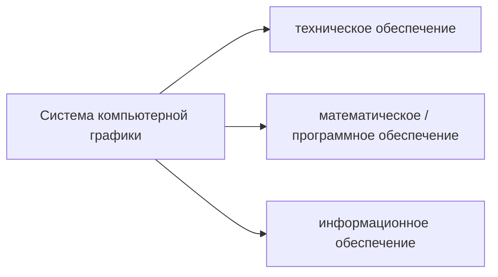

КГ -- картинка, созданная искусственно, во многих случаях человеком. Например, в автокаде человек сам создаёт какое-то изображение. Или человек берёт графический редактор и рисует там.

КГ -- это изображение. Чтобы его изобразить на экране, нужно его преобразовать в растровую форму, то есть представить компактное векторное изображение в виде матрицы пикселей.

ОИ -- когда на входе аппаратно-программной системы есть изображение, получаемое через какой-то вид датчика (например, камера), то есть это изображение реального мира. Оно сразу попадает в виде растровой картинки. Например, камеры на роботе, оптические электронные микроскопы и так далее. И уже с этой входной растровой картинкой что-то делается.

Какова связь с КГ и векторными картинками? Вечная задача: задача векторизации введённой растровой картинки. Если удаётся растровую картинку описать в виде набора математических моделей, это очень резко сокращает объём информации, которую необходимо хранить. Эта задача до сих пор не автоматизирована.

Например, картография: самолёт ведёт съёмку земной поверхности и одна из задач: корректировка карт местности, над которой мы пролетели: например, русло реки почему-то изменило своё прохождение, почему-то выросли новые города, появилось поле, вырос лес, и это всё надо перенести на карту. По сей день это полуавтоматизированная вещь с участием человека, которые по-прежнему принимают окончательное решение.

лабы ведет кларин

с 10 утра до 15-16

кларин

лабы по гимпу лучше делать на своём компе, на кафедре древняя версия. 

лабник можно забрать у титова или попросить чепина прислать на почту

1 работу по обработке изображений можно принять дистанционно, вторую желательно очно

кто захочет выполнить доп задание: там можно фантазировать, подумать что хотели бы сделать и в какой области, можно что-то выбрать и ориентируясь на какой-нибудь opencv создать какое-нибудь небольшое приложение. Лучше начать обсуждать сейчас, потому что на обсуждение может уйти до 4 недель.

### Прикладные задачи и области применения
- медицина: рентгенография, томография, автоматизированная диагностика и тп
- 
---

**Текстовый документ** -- совокупность алфавитно-цифровых символов и спецзнаков

**Графическая информация или графический документ** -- любая совокупность графических элементов или примитивов (точка, линия, дуга, окружность), а также изображений или текстов.

Можно говорить, что текстовая информация в общем-то частный случай графической.

Сам термин КГ, а ранее машинная графика, обозначает автоматизацию кодирования, обработки и декодирования графической информации. Иными словами, ввод в компьютер исходных данных, представленных в графической форме, обработку этой информации с помощью специальных графических программ и вывод результатов расчётов или моделирования в виде различных графических изображений.

Таким образом, графическое изображение является как исходным, так и конечным продуктом компьютерной графики.

Компьютерная графика -- это создание изображений с помощью компьютера.

Уровень развития КГ определяет эффективность функционирования современных IT технологий. КГ обеспечивает решения практического использования IT, то есть поддерживает взаимодействие пользователя с вычислительной машиной или системой, то есть решает проблему HCI -- human-computer interaction,

Как одной из научных направлений КГ является создание GUI, причём более важна реализация этого взаимодействия -- режим inline.

Стоит отметить, что впервые режим интерактивного взаимодействия был обеспечен в ScratchPad в MIT в конце 60-ых под руководством Айзека Сайзерленда.

В настоящее время в КГ оформились три основных направления обработки графической информации

I. Создание изображения из графических примитивов и его визуализация или возможность просмотра исходя из модельного описания того, что требуется отобразить.

В ряде графических пакетов это направление объединено в корневом каталоге графического редактора под корнем Draw (рисование).

II. Обработка изображения или преобразование изображения

В большинстве графических процедур это скрыто под корнем Edit / Modify.

Задачей ОИ мб или специальное преобразование, кардинально меняющее существующее изображение, или улучшение изображения (реконструкция, реставрация, раскраска) в зависимости от определённых или заданных критериев обработки этого изображения.

III. Распознавание образов или получение описания и анализ изображений исследуемых графических объектов.

Цель распознавания -- выделение отдельных элементов на изображении или классификация изображений в целом. Или, например, определение динамических объектов -- тех, которые изменяют своё положение относительно каких-то опорных маркеров на изображении.

В этом направлении как инструмент используется **когнитивная графика**, или графика, облегчающая познания. Эта графика занимается синтезом или анализом абстрактных изображений, не имеющих реальных физических аналогов. Например, построение диаграмм, гистограмм, графиков распределений, которые в наглядной форме представляют абстрактные сущности как результат творческой и умственной работы пользователя.

План курса

1. Концепция и возможности КГ
2. Математические основы создания моделей-описаний геометрических объектов и моделей преобразований ГО
3. Современные дисплейные технологии представления графической информации
4. Разделы ПО КГ

КГ и родственная ей вычислительная геометрия являются самостоятельным со своими проблемами и спецификой и областями деятельности. В основе этх дисциплин в теортическом плане лежат разделы р=гоеметрии: ангем, начертательна геометрия, дифференаицлаьная геометрия и т.д.. а так же некоторые разделы матричной алгебры, вычислительной математики, которые являются математической базой для построения модели геометрического объекта.

Это можно пояснить следующей схемой:

**Модель ГО** -- создание моделей геометрического объекта относится к теоретическим основам компьютерной графики. Чтобы компьютер понимал, какая информация вводится, должна присутствовать некоторая **прикладная графическая программа**. Чтобы эти программы функционировали в ОС компьютера, должны быть какие-то графические системные оболочки. Это в конце концов обрабатывается ЭВМ

Всё восприятие информации окружающей действительности современном компьютером идёт через понятие **модели**.

**Векторные модели** -- в памяти компьютера объекты представлены координатами характеристических точек и математическими моделями кривых и поверхностей. Например, отрезок задаётся координатами начальной и конечной точки и уравнением прямой, проходящей через эти точки. Точки реального объекта соединяются отрезками прямых линий или векторами.

В **растровой модели** плоская или 2D - пространство, или объёмное 3D пространство состоит из множества одинаковые элементарных областей (пиксель или воксел), а геометрический объект представляется как множество занимаемых им элементов этого дискретного пространства.

Сравнивая эти два подхода, можно сказать, что есть определённые достоинства и недостатки. 

**Плюсы векторной модели**
- высокая точность изображения
- меньшая память для хранения модели геометрического объекта

**Минус** -- худшая реалистичность изображения, потому что в растровой модели элементы растра независимы друг от друга и могут принимать любые значения цвета, тона из допустимого диапазона, то есть как бы изображение складывается из комбинации цветных точек.

Можно говорить о гибридных моделях -- сочетание векторных и растровых форм представления, которые позволяют взаимное преобразование описаний области пространства.

Переход от векторной форме к растровой достаточно прост и заключается в пересчёте координат векторов в адреса пикселей, а именно номер строки и номер столбца в сетке растра на экране монитора.

Обратный переход более сложен, так как возникают неоднозначности преобразования в ряде случаев. 

Следует сказать, что большинство современных устройств графического вывода (мониторы, принтеры) являются в принципе растровыми и отображаются любое изображение в виде совокупности соответствующих цветных или черно-белых точек.

Описание графических данных в цифровом виде в соответствии  с определёнными правилами называют **графическими форматами**.

## Этапы развития систем КГ
Начало развития работ по КГ -- середина 50-ых годов, когда США и СССР провели первые опыты по использованию методов компьютерной графики на ЭВМ, память которых была устроена на электронно-лучевых трубках. На экранах таких трубок тёмные и светлые точки соответствовали логическим нулям и единицам. Следовательно, создавая подходящие двоичные коды, можно получить нужное изображение. Эти опыты послужили стимулом для разработки специальных ЭЛТ, для запоминания характроны. Время запоминания информации на которых было от нескольких минут до двух часов. Эти первые опыты послужили стимулов для разработки специальных ЭЛТ с запоминанием, которые были предназначены для вывода графической информации из ЭВМ.

Следующее десятилетие: к середине 60-ых годов КГ формируется как самостоятельное направление исследований. Начато промышленное производство графопостроителей и векторных дисплеев, образуется рынок новых высоких технологий

Начало 70-ых годов характерно становлением рынка программных продуктов КГ и окончательное его формирование произошло к концу 70-ых годов, когда пришло понимание необходимости стандартизации графических систем. И эта тема в течение ряда нескольких последующих лет была очень злободневна, так как к тому времени в мире функционировало больше сотни оригинальных графических систем с оригинальным устройством, связь между которыми была невозможна.

Ну рубеже 80-ых годов появилась доступная полупроводниковая память и произошёл резкий переход к растровым принципам отображения информации. К этому времени как раз появились первые персональные компьютеры, средства КГ нашли применение именно там, и это снизило их стоимость и увеличило их популярность и доступность.

Середина 80-ых: изменения, связанные с развитием технологии сверхбольших интегральным схем (СБИС, матричные БИС МАБИС и т.д.), привели к созданию рабочих графических станций, произошло их объединение в сети, были разработаны графические сопроцессоры, так как к тому времени были только процессоры с фиксированной точкой и с плавающей точкой; в частности, для поддержки 3Д, БПФ, динамических изображений и тд. Все этти нововведения резко повысили производительность: были созданы графические станции, по мощности не уступавшие суперкомпьютером того времени. Растровая графика в реальном мастабе для объёмной визуализации стала реальностью.

КГ оказала огромное влияние на сферу коммуникации между человеком и компьютером, а также между людьми при помощи графических образов, появился язык общения через картинку.

Существенным стимулом к совершенствованию методов КГ является стремление к реалистичности, даже к фотореалистичности создаваемых изображений. То есть как с помощью компьютера передать на экране дисплея форму, цвет, освещение, движения практически не отличимые от тех, что существуют в действительности. 

Наука ищет формальные подходы к описанию перечисленных процессов.

## Обеспечение графических возможностей в вычислительных системах

Сейчас удовлетворение этой потребности возможно по двум направлениям

1) использование языковых средств, то есть практически во всех ЯП высокого уровня есть специальные программные средства, обеспечивающие графику с той или иной степени. Например, в C есть 4 базовых подпрограммы или функции для реализации графики на устройствах ввода-вывода графической информации, в частности, экрана графического дисплея или чертёжном поле графопостроителя. Это 
	- `initgr()` -- инициализация графического ввода
	-  `move(x, y)` -- позиционирование луча на экране или пера графопостроителя в точке с координатами x, y
	- `draw(x, y)` -- рисование отрезка прямой линии от текущей позиции в заданную точку с координатами x, y
	- `endgr()` -- выполнение ряда операций, связанных с завершением графическом программы.

Используя эти 4 функции, возможно построение графического изображения в виде совокупности коротких отрезков прямых.

2) Использование специальных пакетов графических процедур: например, в САПР это пакеты AutoCAD, pCAD, Mechanical Desktop и т.д., которые имеют специальные графические редакторы и направленность на решение конкретных практических задач. Также есть corel draw, фотошоп и т.д.

Чисто исторически можно вспомнить о **псевдографике**: формировании изображений с помощью символов кода ASCII, которые имеются на стандартной клавиатуре ПК.

Методы и алгоритмы должны обязательно соответствовать архитектуре ПК и ОС. Сейчас также более рационально использовать, например, функции API Windows как интерфейса для разработки прикладных программ, то есть в тексты программ можно включать вызовы функций, которые входят в состав графических функций API, в которой обеспечена аппаратная независимость многих функций от конкретных графических устройств ввода-вывода.

Интересная функция API Windows -- `SetPixel(hdc, x, y, clr)`. Здесь
- `hdc` -- идентификатор контекста графического устройства или некоторое числовое значение, знание которого даёт возможность направить графический вывод в нужное место
- `x`, `y` -- координаты пикселя на плоскости
- `clr` -- цвет пикселя: 4 байтное слово, где 3 младших байта соответствуют компонентам RGB.

С помощью одной это единственной функции возможно создать любое растровое изображение, правда, программа для этого будет большая.

Также для расширения графических возможностей можно использовать библиотеки типа OpenGL и DirectX 3D. Это также наборы API для разработки мультимедийных приложений, связанных с визуализацией 3D графики. 

## Области применения КГ
### 1. Автоматизация проектирования изделий различного назначения 

(около 80%, самая обширная область применения). Прежде всего это САПР в микроэлектронике, используемые в схемотехнике, области машиностроения, авиация, автомобиле- и судостроения как наиболее ёмкие отрасли.

Можно отметить некоторые объективные факторы, влияющие на техническую политику как государств, так и крупных НИИ:
1. Пришло время ограничения всех ресурсов: энергии, материалов, времени, людских ресурсов и раньше всего это осознали страны западной Европы, страны восточной Азии, США
2. Резкий рост числа образцов новой техники
3. Уменьшение срока жизни образца техники, особенно в электронике, ВТ, приборо-, авиастроения и других отраслях
4. Рост уровня сложности образца новой техники, и, как следствие этого, увеличение срока проектирования и рост числа необходимых проектировщиков.

Опыт применения САПР показывает изменение следующих показателей
- на 10-15% улучшаются технические характеристики изделия, сделанного с помощью САПР
- до 20% уменьшается материалоёмкость изделия
- в 2-4 раза сокращается время проектирования изделия
- в 20-50 раз сокращается время на подготовку тех. документации на производство изделия
- появление новых творческих возможностей у проектировщика за счёт возможностей анализа многих вариантов решения задач проектирования в реальном времени.

Есть и недостатки:
- очень дорогое ПО: например, для производства элементов ВТ стоит несколько десятков млн долларов
- кадры и их подготовка -- дорогостоящее удовольствие

Но в то же время по данным UNESCO уровень развития САПР -- показатель интеллектуального развития страны, и, кроме того, САПР -- один из самых дорогих товаров на рынке ПО.

### 2. Автоматизация и визуализация научных исследований
Области применения: ядерная физика, робототехника, медицина, химия, биология и даже социология.

### 3. Обработка различных видов графической информации большого объёма
Это отрасли: метеорология, геология, геодезия, картография, системы ГИС и тд

### 4. Строительство и архитектура

Прежде всего: транспортные сети, дороги, жд, морские и речные коммуникации; трубопроводы: гах, нефть, вода:

массопроводы (химия)

Полученные в 3 пункте хорошие карты и изображения позволяют проложить соответствующие транспортные сети более быстро и качественно, чем в традиционных методах поисковых экспедиций.

### 5. Деловая графика

Это обслуживание бирж, банков, офисов, рекламы и т.д.

### 6. Обучение, самообучение

Использование графики для преподавания в учебных учреждениях, тренажёры, в которых можно имитировать различные ситуации; игры различного назначения

### 7. Искусство
Это мультипликация, анимация, компьютерные театры, выставки, кино

## Графическая система AutoCAD. Характеристики и возможности

Начиная с 1990-ых годов получила широкое распространение.

AutoCAD: automated computer  edit design: 2- и 3-мерная САПР, разработанная компанией Autodesk. Сейчас является наиболее распространённой САПР в мире. Благодаря удачному интерфейсу, AutoCAD является простой в использовании, несмотря на кажущуюся сложность.

За всё время были созданы множество дополнений к AutoCAD за счёт лояльного отношения Autodesk, разрабатываются проблемноориентированные пакеты (их порядка 7000).

### Функциональные возможности

Первые версии автокада оперировали элементарными объектами: окружности, линии, дуги, из которых составлялись более сложные объекты, однако сейчас еть возможности для создания произвольных моделей, в т. ч 3D, улучшенную 3D навигацию и улучшенные средства проектирования документации.

Начиная с 2010 есть поддержка параметрического черчения -- возможности налагать на объект геометрические или размерные зависимости. Это гарантирует, что при внесении изменений в проект определённые параметры и ранее установленные между объектами связи сохраняются.

Кроме того, наличие параметрического черчения повышает интеллектуальные возможности автокада. Например, из области механики: имеется простая механическая деталь -- шайба, которая характеризуется трёмя параметрами: h -- высота, R -- внешний радиус, r -- внутренний радиус. Может оказаться, что при расчёте этих параметров можно найти между ними определённые логические связи: например, h не равно нулю, R > r. Проверяя такие простейшие логические условия, мы уже защищаем себя от ошибок на ранних стадиях проектирования изделии. Кроме того, имея эти параметры, можно сделать библиотеку этих элементов.

В более сложных деталях можно налагать более серьёзные ограничения, которые повышают интеллектуальность системы.

### Современные версии автокада
- есть инструменты работы с произвольными формами, которые позволяют создавать и анализировать сложные трёхмерные обхеты Их формирование и изменение осуществляется простым перетаскивание поверхностей, граней и вершин.
- использование динамических блоков позволяет создавать повторяющиеся элементами в изменяемыми параметрами без необходимости их перечерчивать заново или работать с библиотекой элементов
- функция масштабирования аннотативных объектов на видах экранов или в пространстве модели
- запись операций позволяет формировать последовательность команд даже без опыта программирования. Записываемые команды, значения и параметры регистрируются и сохраняются отображаются в отдельном окне, после завершения работы последовательность команд можно сохранить в файле макроса операций с целью последующего воспроизведения. При коллективной работе эти
- можно создавать физические макеты проекторов через специализированные службы 3д - печати или персональные 3д принтер
- диспетчер подшивок упрощает публикацию, организует листы чертежей, автоматически создаёт виды передаёт данные с подвшиок в сновные надпсии и штемпели и выполняет задания таким образом чтобы вся нужная информация была в одном месте. В этом случае автокад выступает не как ГОСТ, а как стандарт де-факто, то есть ГОСТ имеет требования, которые не включены в версии автокада, однако в ряде версий исправления уже внесены.
- инструменты упрощённой 3д-навигации: видовой куб позволяет переключаться между стандартными и изометрическими видами; как предвариетньло заданмми нтак  и с выбранной ползоввтелем точки, штурвал объединяет в одном месте несколько различных инструментов навигации и предоставляет бытсрый доступ к командам вращения по орбита, зуммирования. 
- интерфейс пользователя поддерживает возможности настройки под конкретные направления работы

Для установки и поддержки соотв версии автокада необходимы серьёзные и дорогостоящие тех средства, причём каждая версия автокада требует как минимум какого-то оборудования и состава ПО. ПРодукты лицензионные, стоимость пакета достаточно высокая.

Чтобы установить и поддерживать автокад 2015 нужны следующие требования
- Win NT4.0, 95, 98
- ОП 32-64 Мб
- ПЗУ: 130 Мб, 200 Мб
- своп: 64 Мб
- Pentuim 1
- Монитор 600*800

## Графические и аналитические способы решения практических задач
Не детализируя сейчас идеи и мат аппараты, достоинства и недостатки, можно отметить, что графический, а точнее геометрический способ, появился гораздо раньше аналитического. Аристотель, Архимед (384, 287 гг до н.э.) дали оригинальные графические решения многих задач науки и техники.

**Преимущества графических методов**
1. Наглядность решения. Это позволяет осуществить контроль и коррекцию решения непосредственно в ходе решения задачи.
2. Обеспечение в ряе случаев более простой возможности получения результата. В аналитических способах решения, получив решение, ещё требуется доказать его верность. "Одна картинка лучше, чем тысяча слов".

В последующее время (после Архимеда) наблюдалось уменьшение применения методов графического решения, т.к. механизация и автоматизация процесса вычислений, свойственных аналитическим методам, намного опередила механизацию графических работ.

Решение любой задачи геометрическим способом состоит в выполнении в определённой последовательности конечного числа геометрических построений. Поэтому можно выделить элементы, объединяющие аналитический и графический методы решения задач:
1. Выполнение в определённой последовательности различных логических, арифметических (графических) операций
2. Наличие промежуточных операций и промежуточных результатов, которые могут быть использованы в ходе последующих операций.
3. Необходимость изменять направление процесса решения в зависимости от этих промежуточных результатов.
4. Конечное число операций, приводящих в решению задачи.

То есть можно говорить о наличии основных составляющих любого алгоритма: следование, выбор (развилка) и повторение.

Примеры условий в графических методах: точка лежит выше/ниже поверхности стола и т.д. (чисто графические условия, по которым можно и

Пути повышения эффективности выполнения графических работ сводятся к двум основным подходам:
1. Усовершенствование старых и разработка новых способов решения задач графическим способом с целью получения наиболее изящных способов решения
2. Машинизация процессов решения задачи: использовать компьютер как инструментальную базу для решения задач, передав ему функции человека, связанные с логическими операциями и геометрическими преобразованиями

Второй путь наиболее перспективен с учётом бурного развития компьютерной техники и наличия периферийных графических устройств. По первому пути очень трудно предсказать появление новых Архимедов, которые генерят серьёзные идеи.

Для автоматизации процесса графического решения задачи было необходимо решить следующие задачи:
1. Необходимо было создать конструкцию читающего устройства типа "аналог - код"
2. Разработать теорию обработки информации, получаемой в результате преобразования изображения в код
3. Создать теоретическую базу для программирования графического решения задач и установить критерии, соблюдение которых обеспечивает правильность решения.
4. Разработать методы решения задач, учитывающие возможность их решения с помощью компьютера
5. Для уменьшения объёма вводимой информации продумать методы и организацию данных, предназначенных для решения с помощью компьютера
6. Создать конструкцию пишущего устройства "код - аналог".

Перечисленные проблемы, наверное, и есть суть предмета "компьютерная графика".

## Компоненты системы компьютерной графики. Характеристики основных компонент системы компьютерной графики.

Это можно представить следующей схемой:

Система КГ опирается на три основных составляющих 
- **техническое (аппаратное) обеспечение**
	-  Прежде всего, это аппаратура ввода-вывода графической информации (ГИ).
		- более сотни специализированных устройств на сегодняшний день: мониторы, сканеры и тд
	- конфигурация системы компьютерной графики
		- влияет на производительность, говорит о номенклатуре УВВ, их количестве, дисциплине приоритетов и т.д.
	- режимы работы системы компьютерной графики
		- режим удалённого доступа к системе, коллективного пользования системой или отдельными устройствами, персональный режим (когда все ресурсы выделяются одному пользователю)
- **математическое (программное) обеспечение**
	- модели описания геометрических объектов
	- модели преобразования геометрического объекта (ГО)
	- программное обеспечение ввода-вывода графической информации или драйверы устройств
	- графические языки: средства, описывающие способы построения моделей преобразований и описаний ГО и работы с этими описаниями
	- графические оболочки
	- графические системы (типа автокада) или пакеты прикладных графических программ
	- математическое или программное обеспечение взаимодействия этих графических средств с ОС конкретного компьютера
- **информационное обеспечение**
	

Реализуя тех. обеспечение графических систем, следует подчеркнуть, что этот компонент достаточно статический и медленно меняется во времени.

Характеризуя в целом раздел мат. обеспечения, мы говорим, что это очень динамичная сфера, постоянно развивающаяся за счёт появления новых программных средств и обновления старых.

Под **мат. обеспечением** понимается совокупность необходимых гмат моделей, совокупность языков и технических модулей, 

граф языковых изобразит средств, соотв программ модулей, осчпе в комплексе номальное функц средств компьютерной грфики, причём эффективность в конечном счёте определяестя именно математическим обеспечением

в процессе ункционаирования любой граф системы накапливаются архивы графической информации причём многкоратного использования, которые образуют информационное обеспечение системы КГ. Здесь можно разичить дваварианта созания таких апрхивов
- специализированные архивы графической информации
	- в этом архиве учитывается специфика хранимой информации, но доступ к этой информации обеспечен только тем программам, которые непосредственно относятся к компьютерной графике, то есть чисто графическим программам.
- базы данных общего назначения
	- создание некоторой БД общего назначения. К такой информации в этой базе имеют доступ все программы, функционирующие в системе. Но исходя из такой организации БД, можно говорить, что хранимая информация инварианта по отношению к ПО системы, а специфика обращения к БД графической информации отражается в самой прикладной программе
	- можно отметить, что именно этот вариант является предпочтительным сегодня, так как сейчас в полноценной мере проявляются возможности соответствующих СУБД, в частности, хорошо проработаны вопросы сжатия, архивирования, воспроизведения, поиска нужной информации, что актуально для графической информации ввиду её большого объёма.
- системы управления базами данных (СУБД)

# Растровые преобразования отрезка прямой или скэн-преобразование.

Большинство графических прикладных программ опираются на процедуры формирования на экране монитора отрезков прямых,которые являются элементами многих графических изображений. Прежде всего, это ломаные линии, многоугольники, криволинейные отрезки, которые формируются очень короткими отрезками прямых, залитые замкнутые участки на плоскости, образованные группой соседних параллельных линий и т.д.

В большинстве пакетов графических процедур отрезок прямой задаётся только координатами начальной и конечной точек отрезка. Поэтому, так как прямая часта используется в видеографике, необходим эффективные алгоритмы для преобразования координат концов отрезка в набор пикселов в видеобуфере, который наиболее точно аппроксимирует заданный отрезок. Этот процесс называют **растровым преобразованием отрезка прямой** или **скэн-преобразованием**.

## Экранные и пиксельные координаты

Экран диспле независимо от используемой технологии отображения представляет свобо двумерную плокости, для описания которой удобно использовать декартову систему, напраавления координатных осей которых начально координатной системы расположено в левом нижнем углу экрана.

В ряде случаев было бы очень удобно, чтобы единица длины по горизонтали имела бы те же самые реальные размеры, как одна единица в вертикальном направлении. Обычно в качестве единицы измерения в каждом напарвлении используется один дюйм.

Было бы полезно знать максимальное значение Максимальное значение, которое можно было бы использовать для каждой координаты. Причем для этих максимальных значений, вместо того, чтобы задавать точные развемы кранов дивпслей. которые разные, были выбраны "крыгле" числа, напримве, 10 и 7, 14 и 10, с учетов, что их отношение довольно хорошо соапвдаает с сосотоншением сторон по двум напарвлением для большинства дисплеевю. Тогда экранные координаты будут определяться вещественным чисалми, которые условно задаются строчными буквами $x$ и $y$.

$$\begin{cases}0\leq x\leq x_{max}\\ 0\leq y\leq y_{max}\end{cases}$$

Также удобны пиксельные координаты, которые обычно обозначаются прописными буквами $X$ и $Y$.

$$\begin{cases}0\leq X\leq X_{max}\\ 0\leq Y\leq Y_{max}\end{cases}$$
$X_{max}$ и $Y_{max}$ определяются количеством пикселов в строке и количеством строк пикселей. Например, 712 и 247.

Как видно, писклельные координаты это **целые числа**.

В системе писклельных координат обычно начально кординаты распололжено в левом верхннем углу экрана.

**Коэфф масштабирования** определяет как отношение писклельных координат к экранным по оси Х и У, т.н. горизонтальный и вертикальный фактор.

В ЯП выского увроян вводятся функции или операторы приведения типов, которые преобрвзауют кранные координаты, используемые на высшем пользовательнском уровне, к писклельным, которые необхоимы на низком уровне при орбазении к аким-то, например, адаптеорм. При этом преобрвзоании прооисходят необходимые округления.

## Постановка задачи растрирования
Заданы две точки отрезка: начальная $P_1$ и конечная P2. Необходимо вычислить промежуточные точки пиксели и адреса в памяти видеобуфера. Так как таких точек очень много, предпочиттельнее использовть целочисленную рифметику для повышения бытсродецсивя.

Для нахождения промедутчнх точек выполнм след преобрвзоания:

в качестве начальной точки выберем P1. В начале x = x1, y = y1. дале в цикле всегда буде давать приращение 

По оси x будем называть приращение delta x = 1 для переменной $x$ и будем оставлять y или без изменения, или же увеиличвать его только на 1.

причём выбор этого действия всегда должен быть таким чтобы новая точка располагалась по возможности ближе к истинной прямой, проходящей через начальную и конечную точки отрезка

ри жанном расположении коонечных точек мы получим следующее распределение пикселей, которые наиболее точно отображают отрезок прямой, проходящей через начальную и конечную точки.

В процессе растризации неолбходтмо вычислить больше колво промежуточных точек или адресов пикселей. Так так таких точек мб очень монго, предпочтительнее и

для нахожденя точек между нач и кне точками отрезка выплнм след операии

**Обще подходы**
1. Использование уравнения прямой на полоскости y  = Ax + B. Его можно использовать для вычисления координаты Y по изветсной координыт X между конечными точками прямой, а именно

yi = A * xi + B

Соответственно, y_i+1 = A($x_i + \Delta x$) + B = Axi + B + A delta X = **yi + A delta X**

Таким образом, имеем рекуррентную формулу для определения можества точек или последовательности  координат промежуточных точек, принадлежащих прямой. 

Оценим этот алгоритм с позиции затрат времени. Хотя он достаточно простой, можно отметить, что он очень медленный, так как здесь есть операции
- сложение
- умножение
- целочисленное округление

так как А и В -- вещественые числа, то для вычисленй окординат приходится использовать процессор с плавающей запятой.

Состав операций
- умножение -- длинная операция. Так как промежуточных точек очень много, то эти вычисления длительные по времени

В конце надо сделать опять операцию целочисленного округления.

Поэтому разработчики стараются найти более быстрые методы растризации или скэн-преобразования. Например, вычисление координаты у по приращениям, то есть по известным кординатам х у начального писклея приямой с помощью прибалвения приращения по координате х и у можно найти положение или адрес следующего пикселя. Этот алгоритм был предложен Брезенхемом и номит названием **алгоритма Брезенхема**

### Алгоритм Брезенхема
По сравнению с первым подходом более быстрый.

Следаем сделующие предполжения:
- координаты х конечной точки $x_2$ > x1
- тангенс угла наклона прямой лежит между 0 и 1 ⇒ угол наклона прямой меньше 45 (0 < tg alpha < 1)
- отрезок проходит через начально координат, и поэтому коэффициент В = 0.

будем считать, что пиксель P1 с координатами Хi Yi уже принадлежит нашей прямой. На следующем шаге предстоить выбрать, какой из писклеей -- M или N ближе к точной прямой.

Чтобы определить, какой из пикселей, M или N расположен ближе, найдём разницу их расстояния на прямой вдоль оси Y. Прямая делит его на кусочки $a$ и $b$. 

$$a = (Y_i + 1) - \frac{DY}{DX}(X_i+1)$$$$b = \frac{DY}{DX}(X_i + 1) - Y_I$$ 
На следующем шаге вычисляем разницу $b - a$. Её можно использовать в качестве целевой функции алгоритма, а именно, по знаку разности определять, какой из пикселей -- M или N лежит ближе к точному значению прямой. Понятно, что если b < a, то к точной прямой ближе пиксель N, иначе пиксель M. 

Если подставить в разность b -a формулы и умонжить всё выражение на DX, чтобы избавить от добрей и привести подобные члены, можно получить целевую функцию Di в виде $$(b - a)DX = D_i$$Эта фукнция приращения принимает только целые значения и используя рещультат этого преобразования и выисления знака приращения Di мвы выбираем следующиё пиксель и либо не изменяем координату Y, или же увеличиваем Y на 1 и переходим на следующую строку пикселей и получаем множество пикселей для точного изображения прямой. 

1. Если $D_i < 0$, то выбираем пиксель N, и тогда $$X_{i+1} = X_i + 1$$$$ Y_{i+1} = Yi$$$$\boxed{D_{i+1} = D_i + 2 * DY}$$
2. Если $Di \geq 0$, то выбираем пиксель M и $$X_{i+1} = X_i + 1$$$$Y_{i+1} = Y_i + 1$$$$\boxed{D_{i+1} = D_i + 2 * (DY - DX)}$$

То есть мы имеем итерационные формулы для вычисления следующего значения приращения. Определяя знак этого приращения, мы выполняем то или иное действие по изменению координаты следующего пикселя.

Проанализируем операции по вычислению приращения Di+1. Эти вычисления можно проводить на процессоре с фиксированной точкой. Там есть сложение, вычитание и умножение на 2, а умножение на 2 -- это короткий сдвиг вправо на один разряд, то есть все операции для вычисления приращения -- короткие.

Все данные -- целые числа, поэтому сравнивая этот алгоритм с первым подходом, видно, что здесь имеется серьёзное преимущество по быстродействию.

Эффективность этого алгоритма достигается тем, что самые сложные вычисления -- углов наклона проводят один раз вне цикла, а внутри цикла не нужны вычисления с плавающей точкой. Далее специальная программа определяет адреса пикселя в видеобуфере и устанавливает его значение.

Толщина линии, которую рисует система автокад при выполнении команды `line`, равна 1 пиксель. Физически этот размер определяется разрешающей способностью экрана конкретного монитора.

## Сравнение по эффективности алгоритмов скэн-преобразования 
|Название алгоритма|Язык программирования|Скорость вывода пиксели/c|
|-|-|-|
|Алгоритм на основе уравнения прямой|С|48 000
|Алгоритм Брезенхема|С|160 000
|Алгоритм Брезенхема|Ассемблер| 260 000
|Алгоритм Брезенхема с инкрементной адресацией пикселов|Ассемблер| 700 000

Процессор, на котором производились вычисления -- что-то уровня Pentium 1.

Алгритм Брезенхема с инхкрементоной адресаицей пискеолв: если отрезов прямой проходит параллельно сторонам экрана (орто-режтм автокада), то в этом случае не проводятся преобразования по алгоритму Б., а, например, для горизонатнлього отрезке задаётся положение Yi и оно остаётся фикисрованным для всего изменения координат X от начальной до конечной тлчек отрезка. Самого преобрвзоания и вычисления приращений не производнится. Аналогично для вертикального отрезка: фиксируется номер столбца Xi, он остаётся неизменным на всём диапазоне изменения Y от начальной от конечной позиции.

### Частные случаи расположения прямой на плоскости
Если прямая имеет наклон не в диапазоне от 0 до 45 градусов, то происходит модификация алгоритма.

Для наклона от 0 до -45 градусов достаточно лишь изменить знак инкремента Y.

Для углов наклона больше 45 градусов используется тот же алгоритм, но с обменом координат X и Y местами. То есть есть две ветви алгоритма и отдельное определение случаев вертикальных и горизонтальных прямых.

### Повышение эффективности алгоритма

Для малых углов справделиво выражение $$\sin \alpha \sim \tg\alpha \sim \alpha$$Поэтому выбирая малые значения $\alpha$, мы можем относить такие прямые к вертикальным, и для их изображения не проводим преобразования по алгоритму. Такую прямую, идущую под малым углом, можно изображать в виде последовательности маленьких прямолинейных горизонтальных отрезков, смещённых на 1 пиксель относительно друг друга, и аналогично для вертикальных случаев. Меняя количество и длину этих отрезков, можно для соответствующих углов наклона подобрать соответствующее отображение прямой, что также повышает производительность скэн-преобразования.

### Достоинства алгоритма
Простота и целочисленность. Он является основой для генерации отрезков прямых в большиснвте видеосистем.

### Недостатки
Необходимость задания координат концов отрезков целыми числами. При реальном модеировании сложных объектов их координаты обычно заданы в мировой, или экранной системе координаты и представлены в виде чисел с плавающей запятой. Очевидно, для оторбажения экрана необходимо преобрвзаоывать координаты отображаемого объекта из мировой/экранной системы в пиксельную, поэтому все действительные числа округляются ⇒ на этом этапе вносится погрешность ⇒ нежелательные эффекты:
- степчнаытлестничный эффект:  проявляется в большей степени при оторжаении лиини, наклон которых мало отличается от направления координатных осей. он не зависит от тчность представленея гладкой линии в вде последователности писклеей и являетсчя в принципе неустранимым. Правда, этот эффет можно существенно ослаить, если для каждого пикселы варьировать цвет или тон при его отбражении
- муаровый эффект, который проявляется при изображении семейства близких линий или штриховки
<!--stackedit_data:
eyJoaXN0b3J5IjpbNzIyODUxOTYxLDM4MTQ1MjIzNSwtMTE5ND
UwODUwMCwyMzY0MDA4MDIsNTI5ODg4MjUsMjY3ODU4ODcxXX0=

-->